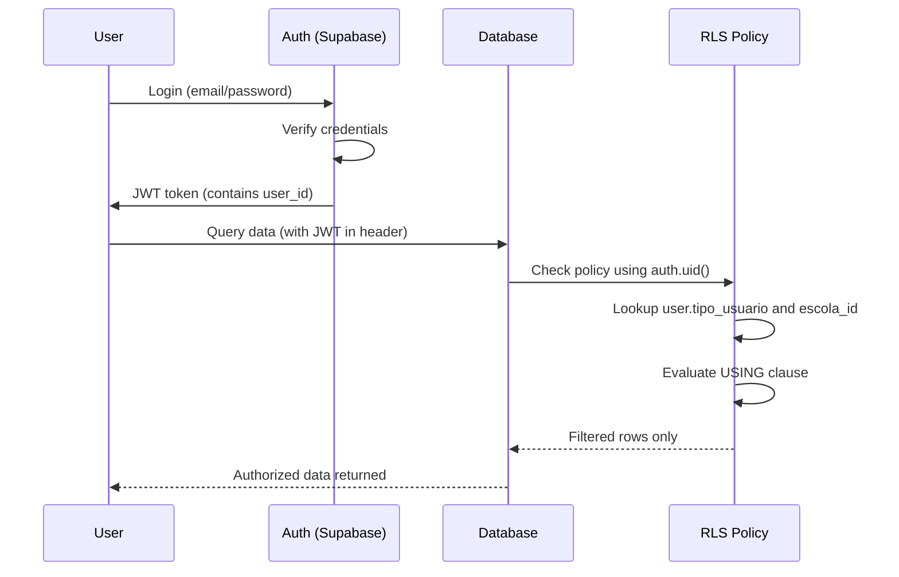
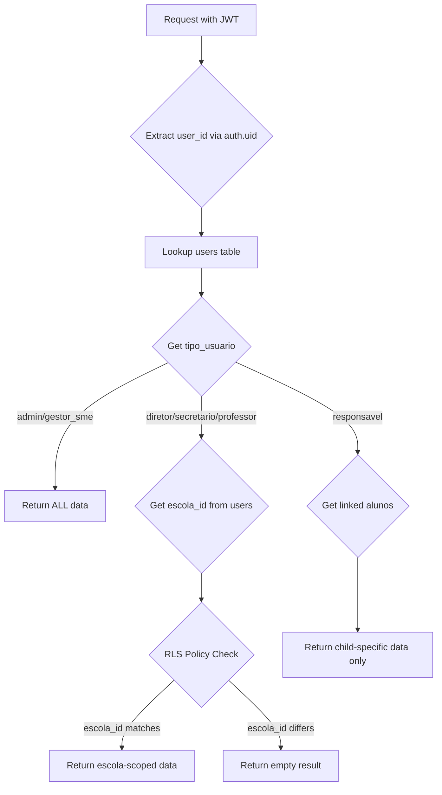
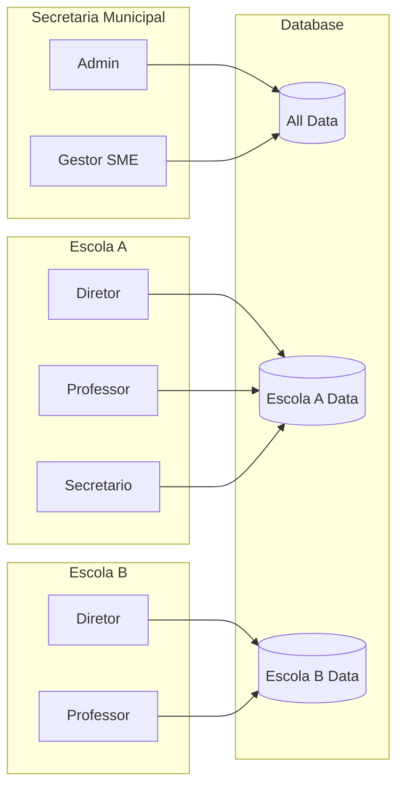

# RLS Policies - EDUCA System

**Last Updated:** Janeiro 2026
**Version:** 1.0
**Migration Reference:** `supabase/migrations/20260119_create_feature_flags.sql`

---

## Overview / Visao Geral

Row Level Security (RLS) is a PostgreSQL feature that restricts which rows users can access in database tables. In EDUCA, RLS enforces:

- **Isolamento de dados por escola** - School data isolation prevents cross-school data leakage
- **Protecao de dados de alunos (LGPD)** - Student data protection per Brazilian LGPD requirements
- **Controle de acesso por perfil** - Role-based access ensures users only see data relevant to their role

### How RLS Works in EDUCA

1. User authenticates via Supabase Auth
2. JWT token contains `user_id` (auth.uid())
3. User profile in `users` table contains `tipo_usuario` (role) and `escola_id`
4. RLS policies check these values to filter data access

---

## Security Matrix / Matriz de Seguranca

Quick reference showing role x action x resource permissions.

### Core Data Tables

| Recurso | admin | gestor_sme | diretor | secretario | professor | responsavel |
|---------|-------|------------|---------|------------|-----------|-------------|
| escolas | CRUD | CRUD | R | R | R | - |
| users | CRUD | CRUD | R (escola) | R (escola) | R (self) | R (self) |
| turmas | CRUD | CRUD | CRUD (escola) | R (escola) | R (atribuidas) | - |
| alunos | CRUD | CRUD | CRUD (escola) | R (escola) | R (turma) | R (filhos) |
| matriculas | CRUD | CRUD | CRUD (escola) | R (escola) | R (turma) | R (filhos) |
| responsaveis | CRUD | CRUD | R (escola) | R (escola) | R (turma) | R (self) |

### Attendance & Grades

| Recurso | admin | gestor_sme | diretor | secretario | professor | responsavel |
|---------|-------|------------|---------|------------|-----------|-------------|
| frequencia | CRUD | CRUD | R (escola) | R (escola) | CRU (turma) | R (filhos) |
| sessoes_aula | CRUD | CRUD | R (escola) | R (escola) | CRUD (own) | - |
| aulas_abertas | CRUD | CRUD | R (escola) | R (escola) | CRUD (own) | - |
| notas | CRUD | CRUD | R (escola) | R (escola) | CRU (turma) | R (filhos) |

### System Configuration

| Recurso | admin | gestor_sme | diretor | secretario | professor | responsavel |
|---------|-------|------------|---------|------------|-----------|-------------|
| configs | CRUD | CRUD | R (escola) | R (escola) | R | R |
| disciplinas | CRUD | CRUD | R (escola) | R (escola) | R | - |
| feature_flags | CRUD | CRUD | R | R | R | R |
| escola_feature_flags | CRUD | CRUD | R (escola) | R (escola) | R (escola) | R (escola) |

### Audit & Compliance

| Recurso | admin | gestor_sme | diretor | secretario | professor | responsavel |
|---------|-------|------------|---------|------------|-----------|-------------|
| audit_logs | R | R | R (escola) | - | - | - |
| audit_trail | R | R | R (escola) | - | - | - |
| audit_sessoes_aula | R | R | R (escola) | - | - | - |
| codigos_inep | CRUD | CRUD | R (escola) | R (escola) | - | - |
| educacenso_exports | CRUD | CRUD | R (escola) | R (escola) | - | - |

### Legend / Legenda

- **C** = Create (INSERT)
- **R** = Read (SELECT)
- **U** = Update (UPDATE)
- **D** = Delete (DELETE)
- **(escola)** = limited to user's assigned school
- **(turma)** = limited to assigned classes
- **(atribuidas)** = limited to classes where user is assigned professor
- **(filhos)** = limited to own children
- **(self)** = limited to own profile
- **(own)** = limited to records created by user
- **-** = no access

---

## Policies by Role / Politicas por Perfil

### Admin / Administrador

**O que pode fazer:** Full system access for management, configuration, and audit.

**Por que:** Administrators need unrestricted access to:
- Configure system-wide settings
- Manage all schools and users
- Troubleshoot issues across the entire system
- Generate cross-school reports
- Manage feature flags and rollouts

**Access Pattern:**
```sql
-- Admin check pattern
EXISTS (
  SELECT 1 FROM users
  WHERE users.id = auth.uid()
  AND users.tipo_usuario = 'admin'
)
```

**Tables accessible:** All tables with full CRUD operations.

---

### Gestor SME / Secretario Municipal de Educacao

**O que pode fazer:** Similar to admin, manages municipal education across all schools.

**Por que:** The Municipal Education Secretary needs oversight of:
- All schools in the municipality
- Cross-school attendance and grade reports
- Educacenso compliance data
- System-wide configuration

**Access Pattern:**
```sql
-- Gestor SME check pattern (same as admin)
EXISTS (
  SELECT 1 FROM users
  WHERE users.id = auth.uid()
  AND users.tipo_usuario IN ('admin', 'gestor_sme')
)
```

**Tables accessible:** All tables with full CRUD operations.

---

### Diretor / School Director

**O que pode fazer:** Full access within their assigned school only.

**Por que:** School directors manage their school's:
- Student enrollments and records
- Class assignments and schedules
- Teacher assignments
- Attendance and grade oversight
- School-level reports

**Restrictions:**
- Can only see/modify data for their `escola_id`
- Cannot create new schools
- Cannot modify system-wide settings
- Cannot manage other schools' data

**Access Pattern:**
```sql
-- Diretor escola-scoped check
EXISTS (
  SELECT 1 FROM users
  WHERE users.id = auth.uid()
  AND users.tipo_usuario = 'diretor'
  AND users.escola_id = target_table.escola_id
)
```

**Example - Viewing students:**
- Sees all students enrolled in classes at their school
- Cannot see students from other schools

---

### Secretario Escolar / School Secretary

**O que pode fazer:** Read access to school data, administrative support functions.

**Por que:** School secretaries need to:
- View student and enrollment records
- Generate school reports
- Support director with administrative tasks

**Restrictions:**
- Similar to diretor but typically read-only for most tables
- Limited to their assigned `escola_id`
- Cannot modify critical data without director approval

**Access Pattern:**
```sql
-- Secretario escola-scoped check
EXISTS (
  SELECT 1 FROM users
  WHERE users.id = auth.uid()
  AND users.tipo_usuario = 'secretario'
  AND users.escola_id = target_table.escola_id
)
```

---

### Professor / Teacher

**O que pode fazer:** Access to assigned classes and their students.

**Por que:** Teachers need to:
- Take attendance for their classes
- Enter grades for their students
- View student information (read-only)
- Create and manage class sessions

**Restrictions:**
- Can only see students in their assigned `turmas`
- Read-only access to student personal data
- Write access only for attendance, grades, and class sessions
- Cannot access other teachers' classes

**Access Pattern:**
```sql
-- Professor turma-scoped check
EXISTS (
  SELECT 1 FROM turmas
  WHERE turmas.professor_id = auth.uid()
  AND turmas.id = target_table.turma_id
)
-- OR for sessoes_aula owned by professor
professor_id = auth.uid()
```

**Example - Taking attendance:**
- Can mark attendance for students in their assigned classes
- Cannot modify attendance for other teachers' classes
- Attendance locked after 18:00 (business rule, not RLS)

---

### Responsavel / Parent/Guardian

**O que pode fazer:** View-only access to their children's data.

**Por que:** Parents/guardians need to:
- Monitor their children's attendance
- View grades and progress
- Receive communications from school

**Restrictions:**
- Only sees data for `alunos` where they are listed as `responsavel`
- Read-only access (cannot modify any records)
- Cannot access other students or school-wide data
- Cannot see teacher or staff information

**Access Pattern:**
```sql
-- Responsavel child-scoped check
EXISTS (
  SELECT 1 FROM aluno_responsaveis ar
  JOIN alunos a ON ar.aluno_id = a.id
  WHERE ar.responsavel_id IN (
    SELECT id FROM responsaveis WHERE user_id = auth.uid()
  )
  AND target_table.aluno_id = a.id
)
```

**Example - Viewing attendance:**
- Sees attendance records for their children only
- Cannot see other students' attendance
- Cannot modify any attendance records

---

## Data Flow Diagrams / Fluxo de Dados

### Authentication Flow / Fluxo de Autenticacao



### School Data Isolation / Isolamento por Escola



### Multi-tenant Data Access / Acesso Multi-tenant



---

## Tables with RLS / Tabelas com RLS

### escolas

- **RLS:** Should be enabled
- **Purpose:** School master data and isolation anchor
- **Key columns:** `id`, `codigo`, `nome`, `diretor_id`
- **Isolation:** All escola-scoped tables reference `escolas.id`

**Expected Policies:**
- Admin/Gestor can CRUD all schools
- Diretor/Secretario/Professor can READ own school only

---

### users

- **RLS:** Should be enabled
- **Purpose:** User profile and role assignment
- **Key columns:** `id`, `tipo_usuario`, `escola_id`
- **Sensitive:** Contains user PII (nome, email)

**Expected Policies:**
- Admin/Gestor can CRUD all users
- Diretor can READ users at their escola
- Users can READ own profile

---

### turmas

- **RLS:** Should be enabled
- **Purpose:** Class definitions tied to schools
- **Key columns:** `id`, `escola_id`, `professor_id`
- **Isolation:** Via `escola_id` foreign key

**Expected Policies:**
- Admin/Gestor can CRUD all
- Diretor can CRUD at their escola
- Professor can READ assigned turmas

---

### alunos

- **RLS:** Should be enabled (LGPD critical)
- **Purpose:** Student master data
- **Key columns:** `id`, `nome_completo`, `cpf`, `data_nascimento`
- **Sensitive:** Contains minor PII - requires strict protection

**Expected Policies:**
- Admin/Gestor can CRUD all
- Diretor can CRUD at escola (via matriculas->turmas)
- Professor can READ students in their turmas
- Responsavel can READ own children only

---

### matriculas

- **RLS:** Should be enabled
- **Purpose:** Student enrollment linking aluno to turma
- **Key columns:** `id`, `aluno_id`, `turma_id`, `situacao`
- **Isolation:** Via turma->escola chain

**Expected Policies:**
- Admin/Gestor can CRUD all
- Diretor can CRUD at escola
- Professor can READ for assigned turmas
- Responsavel can READ own children's enrollments

---

### frequencia

- **RLS:** Should be enabled (compliance critical)
- **Purpose:** Daily attendance records
- **Key columns:** `id`, `matricula_id`, `data_aula`, `presente`
- **Compliance:** "nao existe o esquecer" - attendance is immutable

**Expected Policies:**
- Admin/Gestor can CRUD all (audit trail required)
- Diretor can READ at escola
- Professor can CRU for their turmas (limited time window)
- Responsavel can READ own children's attendance

---

### sessoes_aula

- **RLS:** Should be enabled
- **Purpose:** Class session records with content
- **Key columns:** `id`, `escola_id`, `professor_id`, `turma_id`
- **Ownership:** Professor owns their sessions

**Expected Policies:**
- Admin/Gestor can CRUD all
- Diretor can READ at escola
- Professor can CRUD own sessions

---

### notas

- **RLS:** Should be enabled (LGPD)
- **Purpose:** Student grades by subject/bimestre
- **Key columns:** `id`, `matricula_id`, `nota`, `disciplina`
- **Sensitive:** Academic performance data

**Expected Policies:**
- Admin/Gestor can CRUD all
- Diretor can READ at escola
- Professor can CRU for their turmas
- Responsavel can READ own children's grades

---

### responsaveis

- **RLS:** Should be enabled (LGPD critical)
- **Purpose:** Parent/guardian contact information
- **Key columns:** `id`, `nome`, `cpf`, `telefone`, `lgpd_consentimento`
- **Sensitive:** Adult PII with LGPD consent tracking

**Expected Policies:**
- Admin/Gestor can CRUD all
- Diretor can READ at escola (via aluno link)
- Responsavel can READ/UPDATE own profile

---

### feature_flags

- **RLS:** Enabled (from Phase 9 migration)
- **Purpose:** Feature flag definitions for gradual rollout
- **Key columns:** `id`, `flag_name`, `description`, `is_active`

**Policies (implemented):**
- "Authenticated users can read active flags" - All users can see flag definitions
- "Admin can manage flags" - Only admin/gestor_sme can create/modify flags

---

### escola_feature_flags

- **RLS:** Enabled (from Phase 9 migration)
- **Purpose:** Per-school flag enablement
- **Key columns:** `id`, `escola_id`, `flag_id`, `enabled`

**Policies (implemented):**
- "Users can read own escola flags" - Users see their school's flags OR admin sees all
- "Admin can manage escola flags" - Only admin/gestor_sme can toggle flags

---

### audit_logs / audit_trail / audit_sessoes_aula

- **RLS:** Should be enabled
- **Purpose:** Compliance and audit logging
- **Sensitive:** Contains operational history

**Expected Policies:**
- Admin/Gestor can READ all audit records
- Diretor can READ audit records for their escola
- No write access via application (insert-only via triggers)

---

### configs

- **RLS:** Should be enabled
- **Purpose:** System and school-specific configuration
- **Key columns:** `id`, `escola_id`, `chave`, `valor`

**Expected Policies:**
- Admin/Gestor can CRUD all configs
- Escola users can READ escola-specific or global configs

---

## Appendix: SQL Policies / Apendice: Codigo SQL

### feature_flags Policies

```sql
-- =============================================================================
-- Policy: Authenticated users can read active flags
-- Purpose: All logged-in users can see which features exist
-- Rationale: Flag names are not sensitive; visibility enables frontend checks
-- =============================================================================
CREATE POLICY "Authenticated users can read active flags"
  ON feature_flags FOR SELECT
  TO authenticated
  USING (is_active = true);

-- =============================================================================
-- Policy: Admin can manage flags
-- Purpose: Only privileged users can create/modify/delete flag definitions
-- Rationale: Feature rollout is a system-wide configuration change
-- =============================================================================
CREATE POLICY "Admin can manage flags"
  ON feature_flags FOR ALL
  TO authenticated
  USING (
    EXISTS (
      SELECT 1 FROM users
      WHERE users.id = auth.uid()
      AND users.tipo_usuario IN ('admin', 'gestor_sme')
    )
  )
  WITH CHECK (
    EXISTS (
      SELECT 1 FROM users
      WHERE users.id = auth.uid()
      AND users.tipo_usuario IN ('admin', 'gestor_sme')
    )
  );
```

### escola_feature_flags Policies

```sql
-- =============================================================================
-- Policy: Users can read own escola flags
-- Purpose: Users can check if features are enabled for their school
-- Rationale: Frontend needs to know which features to show/hide
-- =============================================================================
CREATE POLICY "Users can read own escola flags"
  ON escola_feature_flags FOR SELECT
  TO authenticated
  USING (
    escola_id IN (
      SELECT escola_id FROM users WHERE id = auth.uid()
    )
    OR EXISTS (
      SELECT 1 FROM users
      WHERE users.id = auth.uid()
      AND users.tipo_usuario IN ('admin', 'gestor_sme')
    )
  );

-- =============================================================================
-- Policy: Admin can manage escola flags
-- Purpose: Only privileged users can enable/disable features per school
-- Rationale: Feature rollout decisions are administrative, not user-driven
-- =============================================================================
CREATE POLICY "Admin can manage escola flags"
  ON escola_feature_flags FOR ALL
  TO authenticated
  USING (
    EXISTS (
      SELECT 1 FROM users
      WHERE users.id = auth.uid()
      AND users.tipo_usuario IN ('admin', 'gestor_sme')
    )
  )
  WITH CHECK (
    EXISTS (
      SELECT 1 FROM users
      WHERE users.id = auth.uid()
      AND users.tipo_usuario IN ('admin', 'gestor_sme')
    )
  );
```

### Common RLS Patterns / Padroes Comuns

```sql
-- =============================================================================
-- Pattern: Admin bypass
-- Use when: Table should be fully accessible to system administrators
-- =============================================================================
CREATE POLICY "admin_full_access" ON target_table
  FOR ALL TO authenticated
  USING (
    EXISTS (
      SELECT 1 FROM users
      WHERE users.id = auth.uid()
      AND users.tipo_usuario IN ('admin', 'gestor_sme')
    )
  );

-- =============================================================================
-- Pattern: School-scoped access
-- Use when: Data belongs to a specific escola and should be isolated
-- =============================================================================
CREATE POLICY "escola_scoped_access" ON target_table
  FOR ALL TO authenticated
  USING (
    escola_id IN (
      SELECT escola_id FROM users WHERE id = auth.uid()
    )
    OR EXISTS (
      SELECT 1 FROM users
      WHERE users.id = auth.uid()
      AND users.tipo_usuario IN ('admin', 'gestor_sme')
    )
  );

-- =============================================================================
-- Pattern: Turma-scoped for professors
-- Use when: Professor should only access their assigned classes
-- =============================================================================
CREATE POLICY "professor_turma_access" ON target_table
  FOR SELECT TO authenticated
  USING (
    turma_id IN (
      SELECT id FROM turmas WHERE professor_id = auth.uid()
    )
    OR EXISTS (
      SELECT 1 FROM users
      WHERE users.id = auth.uid()
      AND users.tipo_usuario IN ('admin', 'gestor_sme', 'diretor')
      AND users.escola_id = (
        SELECT escola_id FROM turmas WHERE id = target_table.turma_id
      )
    )
  );

-- =============================================================================
-- Pattern: Self-only access
-- Use when: Users should only see/modify their own records
-- =============================================================================
CREATE POLICY "self_access" ON users
  FOR SELECT TO authenticated
  USING (id = auth.uid());

-- =============================================================================
-- Pattern: Child-scoped for responsaveis
-- Use when: Parents should only see their children's data
-- =============================================================================
CREATE POLICY "responsavel_child_access" ON target_table
  FOR SELECT TO authenticated
  USING (
    aluno_id IN (
      SELECT ar.aluno_id FROM aluno_responsaveis ar
      JOIN responsaveis r ON ar.responsavel_id = r.id
      WHERE r.user_id = auth.uid()
    )
  );
```

---

## LGPD Compliance Notes / Notas de Conformidade LGPD

### Data Categories

| Categoria | Tabelas | Sensibilidade |
|-----------|---------|---------------|
| Dados de Menores | alunos, frequencia, notas | ALTA - Requer consentimento responsavel |
| PII Adultos | users, responsaveis | MEDIA - Consentimento no cadastro |
| Dados Escolares | escolas, turmas, disciplinas | BAIXA - Dados institucionais |
| Configuracao | configs, feature_flags | BAIXA - Dados de sistema |
| Auditoria | audit_* | MEDIA - Logs operacionais |

### Required Controls

1. **Consentimento documentado** - `responsaveis.lgpd_consentimento` and `lgpd_data_consentimento`
2. **Minimizacao de dados** - RLS ensures users only see necessary data
3. **Direito ao acesso** - Responsaveis can view all data about their children
4. **Rastreabilidade** - Audit tables track all data modifications

---

## Future Considerations / Consideracoes Futuras

### Tables Pending RLS Implementation

The following tables should have RLS enabled when implementing full security:

1. **escolas** - Add escola isolation policies
2. **users** - Add self-access and escola-scoped policies
3. **turmas** - Add escola and professor scoping
4. **alunos** - Add multi-level access (escola, turma, responsavel)
5. **matriculas** - Add escola-scoped access
6. **frequencia** - Add turma-scoped professor access
7. **notas** - Add turma-scoped professor access
8. **responsaveis** - Add self-access policy

### Recommended Migration Order

1. **Phase 1:** System tables (configs, feature_flags) - DONE
2. **Phase 2:** User tables (users, escolas)
3. **Phase 3:** Core data (turmas, alunos, matriculas)
4. **Phase 4:** Operational data (frequencia, notas, sessoes)
5. **Phase 5:** Audit tables (read-only policies)

---

## Contact / Contato

For questions about data access policies and LGPD compliance:

**Secretaria de Educacao de Fronteira**
- **Email:** educacao@fronteira.mg.gov.br
- **Telefone:** (34) 3266-1350
- **Endereco:** Praca Getulio Vargas, 28 - Centro, Fronteira/MG, CEP 38280-000

**Responsavel pelo Tratamento de Dados (LGPD):**
- Secretaria Municipal de Educacao de Fronteira
- Contato via canais acima

---

*Document created: Janeiro 2026*
*Migration reference: `supabase/migrations/20260119_create_feature_flags.sql`*
*Next review: Apos implementacao completa de RLS em todas as tabelas*
