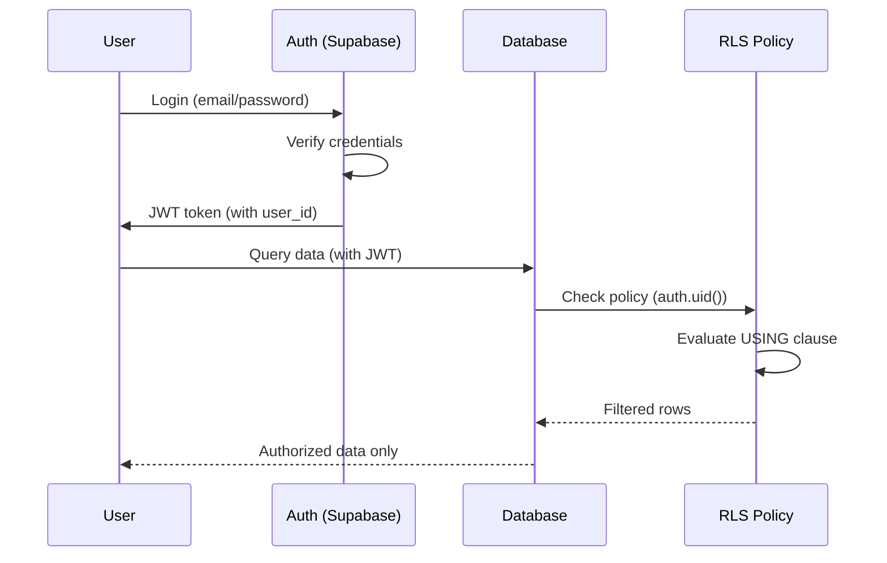
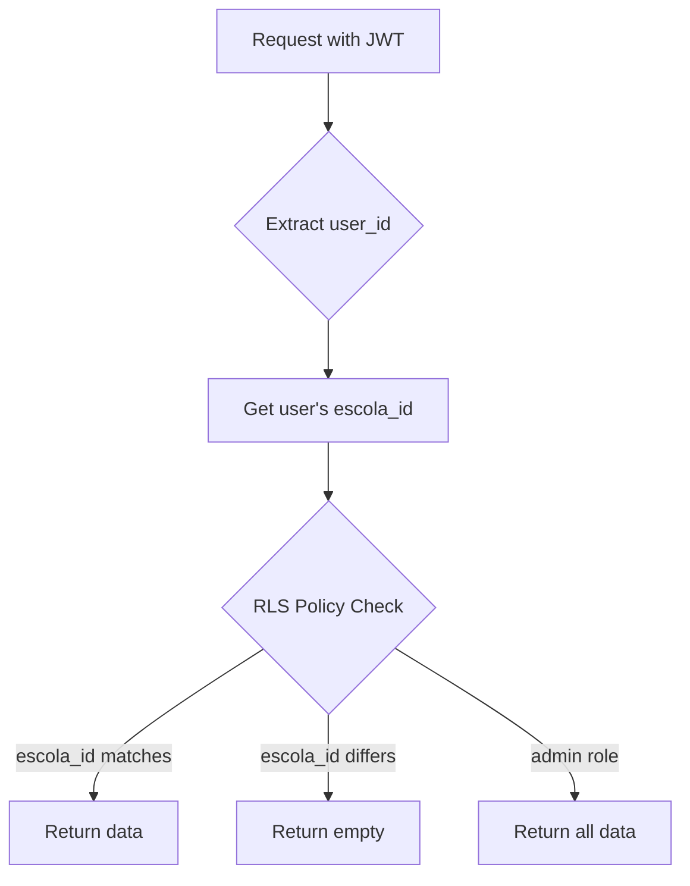

<objective>
Document all RLS policies with security matrix, rationale, and diagrams

Purpose: Create comprehensive RLS documentation for both developers and auditors (SEC-02). Organized by role/perfil with plain language explanations and SQL code in appendix.

Output: RLS-POLICIES.md with security matrix, policy explanations, Mermaid diagrams, and SQL appendix
</objective>

<execution_context>
@~/.claude/get-shit-done/workflows/execute-plan.md
@~/.claude/get-shit-done/templates/summary.md
</execution_context>

<context>
@.planning/PROJECT.md
@.planning/ROADMAP.md
@.planning/phases/10-security-compliance/10-CONTEXT.md
@supabase/migrations/20260119_create_feature_flags.sql
</context>

<tasks>

<task type="auto">
  <name>Task 1: Gather all RLS policies from codebase and migrations</name>
  <files>N/A (analysis task)</files>
  <action>
Analyze the codebase to gather all RLS policies:

1. Read the feature_flags migration for its RLS policies:
   - `supabase/migrations/20260119_create_feature_flags.sql`

2. Search for RLS-related code in the codebase:
   ```bash
   grep -r "CREATE POLICY" --include="*.sql" .
   grep -r "ENABLE ROW LEVEL SECURITY" --include="*.sql" .
   grep -r "RLS" --include="*.ts" --include="*.tsx" .
   ```

3. Check TypeScript types for table references:
   ```bash
   ls gestao_fronteira/types/
   ```

4. Based on the app structure, identify tables that should have RLS:
   - escolas (school isolation)
   - users (user data protection)
   - turmas (school-scoped classes)
   - alunos (student data - sensitive)
   - attendance_records (frequency data)
   - sessoes_aula (class sessions)
   - vivencias (infantil diary)
   - feature_flags (flag definitions)
   - escola_feature_flags (per-school flags)

5. For each table, document:
   - What RLS policies exist (from migrations/SQL)
   - What roles can perform what actions (SELECT, INSERT, UPDATE, DELETE)
   - The USING and WITH CHECK clauses

Create a structured analysis document (internal notes) before writing the final RLS-POLICIES.md.
  </action>
  <verify>
- All tables with RLS identified
- Policies for feature_flags tables documented (from migration)
- Role types identified: admin, gestor_sme, diretor, professor, responsavel
  </verify>
  <done>RLS policy analysis complete with all tables and policies catalogued</done>
</task>

<task type="auto">
  <name>Task 2: Create RLS-POLICIES.md with security matrix and explanations</name>
  <files>.planning/codebase/RLS-POLICIES.md</files>
  <action>
Create comprehensive RLS documentation following the format from 10-CONTEXT.md:

```markdown
# RLS Policies - EDUCA System

**Last Updated:** Janeiro 2026
**Version:** 1.0

## Overview / Visao Geral

Brief explanation of Row Level Security and why it matters for EDUCA.
- Isolamento de dados por escola
- Protecao de dados de alunos (LGPD compliance)
- Controle de acesso por perfil

---

## Security Matrix / Matriz de Seguranca

Quick reference table showing role x action x resource permissions.

| Recurso | admin | gestor_sme | diretor | professor | responsavel |
|---------|-------|------------|---------|-----------|-------------|
| escolas | CRUD | CRUD | R | R | - |
| users | CRUD | CRUD | R (escola) | R (self) | R (self) |
| turmas | CRUD | CRUD | CRUD (escola) | R (atribuidas) | - |
| alunos | CRUD | CRUD | CRUD (escola) | R (turma) | R (filhos) |
| attendance | CRUD | CRUD | R (escola) | CRU (turma) | R (filhos) |
| feature_flags | CRUD | CRUD | R | R | R |

Legend:
- C = Create, R = Read, U = Update, D = Delete
- (escola) = limited to own school
- (turma) = limited to assigned classes
- (filhos) = limited to own children

---

## Policies by Role / Politicas por Perfil

### Admin / Administrador

**O que pode fazer:** Full system access for management and audit.

**Por que:** Admins need unrestricted access to configure schools, manage users, and troubleshoot issues across the entire system.

Tables accessible:
- All tables with full CRUD
- Cross-school data access for reports

### Gestor SME

**O que pode fazer:** Similar to admin, manages municipal education.

**Por que:** Municipal education secretariat needs oversight of all schools.

### Diretor

**O que pode fazer:** Full access within their assigned school.

**Por que:** School directors manage their school's data but cannot access other schools.

Restrictions:
- Can only see/modify data for their escola_id
- Cannot create new schools or system-wide settings

### Professor

**O que pode fazer:** Access to assigned classes and students.

**Por que:** Teachers need to record attendance and view student data, but only for their assigned classes.

Restrictions:
- Read-only for student personal data
- Write access for attendance and grades
- Limited to turmas where they are assigned

### Responsavel

**O que pode fazer:** View-only access to their children's data.

**Por que:** Parents/guardians can monitor their children's attendance and grades but cannot modify records.

Restrictions:
- Only sees data for alunos where they are listed as responsavel
- Cannot access other students or school-wide data

---

## Data Flow Diagrams / Fluxo de Dados

### Authentication Flow



### School Data Isolation



---

## Tables with RLS / Tabelas com RLS

### escolas
- RLS: Enabled
- Purpose: School data isolation
- Policies: [see appendix]

### users
- RLS: Enabled
- Purpose: User profile protection
- Policies: [see appendix]

[... continue for each table ...]

### feature_flags
- RLS: Enabled
- Purpose: Flag definition access control
- Policies:
  - "Authenticated users can read active flags" - All users can see flag definitions
  - "Admin can manage flags" - Only admin/gestor_sme can create/modify flags

### escola_feature_flags
- RLS: Enabled
- Purpose: Per-school flag enablement
- Policies:
  - "Users can read own escola flags" - Users see their school's flags OR admin sees all
  - "Admin can manage escola flags" - Only admin/gestor_sme can toggle flags

---

## Appendix: SQL Policies / Apendice: Codigo SQL

### feature_flags Policies

```sql
-- All authenticated users can read active flags
CREATE POLICY "Authenticated users can read active flags"
  ON feature_flags FOR SELECT
  TO authenticated
  USING (is_active = true);

-- Admin/gestor_sme can manage all flags
CREATE POLICY "Admin can manage flags"
  ON feature_flags FOR ALL
  TO authenticated
  USING (
    EXISTS (
      SELECT 1 FROM users
      WHERE users.id = auth.uid()
      AND users.tipo_usuario IN ('admin', 'gestor_sme')
    )
  )
  WITH CHECK (...);
```

[... continue with all policies ...]

---

## Contact / Contato

For questions about data access policies:

**Secretaria de Educacao de Fronteira**
- Email: educacao@fronteira.mg.gov.br
- Telefone: (34) 3266-1350
- Endereco: Praca Getulio Vargas, 28 - Centro, Fronteira/MG, CEP 38280-000
```

The document should be:
- 200+ lines minimum
- Bilingual (Portuguese explanations, English technical terms)
- Organized: Matrix first, then by role, then tables, SQL in appendix
- Include Mermaid diagrams for data flow visualization
  </action>
  <verify>
- `wc -l .planning/codebase/RLS-POLICIES.md` shows 200+ lines
- `grep -c "Security Matrix" .planning/codebase/RLS-POLICIES.md` returns 1
- `grep -c "mermaid" .planning/codebase/RLS-POLICIES.md` returns 2+
- `grep -c "CREATE POLICY" .planning/codebase/RLS-POLICIES.md` returns 4+ (from appendix)
- Document contains contact info for Secretaria de Educacao
  </verify>
  <done>RLS-POLICIES.md created with security matrix, role explanations, diagrams, and SQL appendix</done>
</task>

</tasks>

<verification>
1. RLS-POLICIES.md exists in .planning/codebase/
2. Security matrix is at the start of the document
3. Each role (admin, gestor_sme, diretor, professor, responsavel) is documented
4. Mermaid diagrams render correctly (check syntax)
5. SQL code is in appendix section
6. Contact information included for Secretaria de Educacao
7. Document is bilingual (Portuguese + English technical terms)
</verification>

<success_criteria>
- Complete RLS-POLICIES.md with 200+ lines
- Security matrix at document start for quick reference
- All roles documented with rationale
- Mermaid diagrams for data flow
- SQL policies in appendix (not inline)
- Contact info for Secretaria de Educacao de Fronteira
</success_criteria>

<output>
After completion, create `.planning/phases/10-security-compliance/10-02-SUMMARY.md`
</output>
