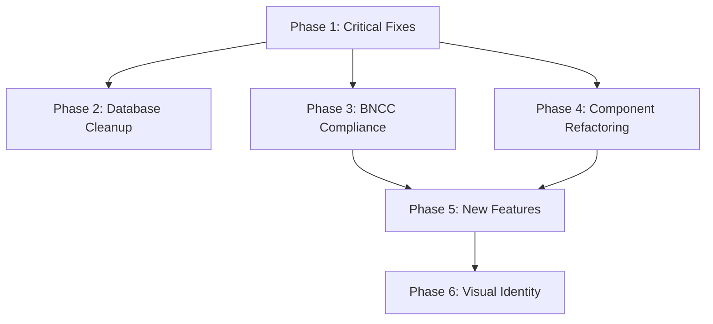

# Prompt: Roadmap Plan

## Objective
Create a prioritized roadmap for EDUCA based on the system audit findings, with focus on reaching MVP for the 2025 school year.

## Context
- Project: EDUCA - Educational management system for Fronteira-MG municipality
- Target: MVP ready for 2025 school year (starts February)
- Current state: See `.prompts/003-system-audit-research/system-audit.md`
- Compliance: BNCC (Base Nacional Comum Curricular) for grades and reports

## Input
Read the system audit output:
- `.prompts/003-system-audit-research/system-audit.md`
- `.audit/AUDIT-REPORT.md`
- `.audit/console-errors.md`
- `.audit/typescript-errors.txt`

## Planning Requirements

### Phase 1: Critical Fixes (Priority: Immediate)
**Goal:** Make the system buildable and deployable

- Fix TypeScript errors blocking build
- Fix console errors causing runtime failures
- Fix broken pages identified in visual audit
- Update Supabase types if schema changed

### Phase 2: Database Cleanup (Priority: High)
**Goal:** Reduce migration complexity

- Identify migrations to consolidate
- Remove obsolete migrations
- Simplify RLS policies
- Verify data integrity after changes

### Phase 3: BNCC Compliance (Priority: High)
**Goal:** Ensure grades and reports comply with Brazilian educational standards

Reference: `docs/bncc.md`

Required for compliance:
- Grade scales per component (Língua Portuguesa, Matemática, etc.)
- Competency-based assessment for Educação Infantil
- Report formats by age group (Bebês, Crianças bem pequenas, Crianças pequenas)
- Progress tracking against learning objectives

### Phase 4: Component Refactoring (Priority: Medium)
**Goal:** Improve maintainability and reduce technical debt

Based on audit findings:
- Remove unused components
- Split large files (>500 lines)
- Add barrel exports
- Standardize naming conventions

### Phase 5: New Features (Priority: Medium)
**Goal:** Add requested functionality

- Help/Tutorial system
- Improved onboarding flow
- Better error messages
- Accessibility improvements

### Phase 6: Visual Identity (Priority: Low - Waiting Input)
**Goal:** Establish consistent design system

- Color palette
- Typography
- Component styling
- Logo and branding

## Output

Create `.prompts/004-roadmap-plan/roadmap.md` with:

```markdown
# EDUCA Roadmap

**Goal:** MVP for 2025 School Year
**Created:** {date}

## Overview

[High-level summary of the roadmap]

## Timeline

```
┌─────────────────────────────────────────────────────────┐
│ Phase 1: Critical Fixes            │ Week 1            │
│ Phase 2: Database Cleanup          │ Week 1-2          │
│ Phase 3: BNCC Compliance           │ Week 2-3          │
│ Phase 4: Component Refactoring     │ Week 3-4          │
│ Phase 5: New Features              │ Week 4-5          │
│ Phase 6: Visual Identity           │ TBD               │
└─────────────────────────────────────────────────────────┘
```

## Phase 1: Critical Fixes

**Duration:** 1 week
**Dependencies:** None

### Tasks
| Task | Priority | Effort | Owner |
|------|----------|--------|-------|
| Fix TypeScript errors in lib/validation/ | P1 | 2h | - |
| Fix Deno module issues in Edge Functions | P1 | 1h | - |
| Fix pages with console errors | P1 | 4h | - |
| Regenerate Supabase types | P1 | 0.5h | - |

### Success Criteria
- [ ] `pnpm typecheck` passes
- [ ] `pnpm build` succeeds
- [ ] No console errors on core pages

### Beads Issues
```bash
bd create --title="Fix TypeScript errors in lib/validation/" --type=bug
bd create --title="Fix Deno module issues in Edge Functions" --type=bug
bd create --title="Fix pages with console errors" --type=bug
bd create --title="Regenerate Supabase types" --type=task
```

## Phase 2: Database Cleanup

**Duration:** 1 week
**Dependencies:** Phase 1 complete

### Tasks
| Task | Priority | Effort | Owner |
|------|----------|--------|-------|
| Audit 42 migrations | P1 | 2h | - |
| Identify obsolete migrations | P1 | 1h | - |
| Create consolidation plan | P2 | 2h | - |
| Execute cleanup (with backup) | P2 | 4h | - |

### Success Criteria
- [ ] Migration count reduced by X%
- [ ] No duplicate RLS policies
- [ ] All data intact after cleanup

### Beads Issues
```bash
bd create --title="Audit database migrations" --type=task
bd create --title="Create migration consolidation plan" --type=task
bd create --title="Execute database cleanup" --type=task
```

## Phase 3: BNCC Compliance

**Duration:** 1-2 weeks
**Dependencies:** Phase 1 complete

### Requirements from BNCC
Based on `docs/bncc.md`:

**Educação Infantil:**
- Campos de Experiências (not disciplines)
- 6 Direitos de Aprendizagem
- 3 age groups with specific objectives

**Ensino Fundamental (1º ao 5º ano):**
- Component-based assessment
- 10 General Competencies
- Focus on literacy (1º-2º ano)

### Tasks
| Task | Priority | Effort | Owner |
|------|----------|--------|-------|
| Review current grade structure | P1 | 2h | - |
| Map to BNCC components | P1 | 4h | - |
| Update grade forms | P2 | 8h | - |
| Update report templates | P2 | 8h | - |
| Add Campos de Experiências | P2 | 4h | - |

### Success Criteria
- [ ] Grades aligned with BNCC components
- [ ] Reports show competency progress
- [ ] Age-appropriate assessment for Educação Infantil

### Beads Issues
```bash
bd create --title="Map current grades to BNCC components" --type=task
bd create --title="Update grade forms for BNCC compliance" --type=feature
bd create --title="Update report templates for BNCC" --type=feature
```

## Phase 4: Component Refactoring

**Duration:** 1-2 weeks
**Dependencies:** Phase 1 complete

### Tasks (Based on Audit)
| Task | Priority | Effort | Owner |
|------|----------|--------|-------|
| Remove unused components | P2 | 2h | - |
| Add barrel exports | P2 | 2h | - |
| Split large files | P3 | 8h | - |
| Standardize naming | P3 | 4h | - |

### Success Criteria
- [ ] No unused components
- [ ] All directories have index.ts
- [ ] No files >500 lines
- [ ] Consistent naming (kebab-case)

### Beads Issues
```bash
bd create --title="Remove unused components" --type=task
bd create --title="Add barrel exports to all component directories" --type=task
bd create --title="Split large component files" --type=task
```

## Phase 5: New Features

**Duration:** 1-2 weeks
**Dependencies:** Phase 3-4 complete

### Tasks
| Task | Priority | Effort | Owner |
|------|----------|--------|-------|
| Help/Tutorial system | P2 | 8h | - |
| Improved onboarding | P2 | 4h | - |
| Better error messages | P3 | 4h | - |
| Accessibility audit | P3 | 4h | - |

### Success Criteria
- [ ] Help accessible from all pages
- [ ] New users can complete onboarding
- [ ] Error messages are actionable
- [ ] WCAG 2.1 AA compliance

### Beads Issues
```bash
bd create --title="Implement Help/Tutorial system" --type=feature
bd create --title="Improve onboarding flow" --type=feature
bd create --title="Improve error messages" --type=task
```

## Phase 6: Visual Identity

**Duration:** TBD
**Dependencies:** User input (site reference)

### Tasks
| Task | Priority | Effort | Owner |
|------|----------|--------|-------|
| Define color palette | P3 | 2h | - |
| Choose typography | P3 | 1h | - |
| Update component styles | P3 | 8h | - |
| Create brand assets | P3 | 4h | - |

### Success Criteria
- [ ] Consistent visual language
- [ ] shadcn/ui compatible theme
- [ ] WCAG color contrast met

## Risk Assessment

| Risk | Probability | Impact | Mitigation |
|------|-------------|--------|------------|
| Database cleanup breaks data | Medium | High | Backup before changes |
| BNCC changes scope | Low | Medium | Scope to MVP only |
| Chrome MCP issues | Low | Low | Fallback to manual testing |

## Dependencies



<metadata>
<confidence>high</confidence>
<dependencies>
- System audit completed (003)
- BNCC requirements documented (docs/bncc.md)
</dependencies>
<open_questions>
- Visual identity direction (waiting user input)
- Exact BNCC requirements for this municipality
</open_questions>
<assumptions>
- MVP scope is core functionality only
- February 2025 deadline
</assumptions>
</metadata>
```

## Success Criteria
- [ ] All 6 phases defined with tasks
- [ ] Beads issues created for each task
- [ ] Dependencies clearly mapped
- [ ] Priorities based on audit findings
- [ ] Effort estimates provided
