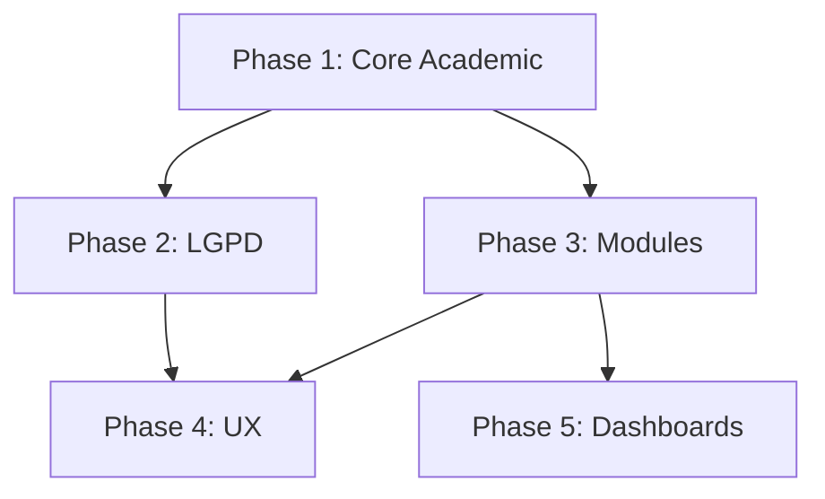

# Prompt: Refine Roadmap Plan

## Objective
Update the existing EDUCA roadmap (004) to reflect current implementation state, align with stakeholder feature roadmap, and provide clear prioritization for MVP Feb/2026.

## Context

### Target File to Update
@.prompts/004-roadmap-plan/roadmap.md

### Reference Files
- @educa-roadmap(1).html - Stakeholder feature roadmap (6 phases)
- @.prompts/006-educa-roadmap-research/educa-roadmap-research.md - Previous research
- @.prompts/007-educa-implementation-plan/educa-implementation-plan.md - Recent implementation plan
- @.claude/plans/crystalline-juggling-clarke.md - Current state analysis (roadmap vs reality)

### What Changed Since 004
Based on current analysis, significant progress was made:

**Now Complete (mark ✅):**
- Phase 0 Foundation: Architecture, Auth, Audit Log, RBAC (~95%)
- Phase 1 partial: Student Registration, Digital Attendance, Diary (Fundamental), School Calendar
- Phase 2 partial: Privacy Policy LGPD, Consent Checkbox
- Phase 3 partial: Bolsa Família Reports, Educacenso Export
- Phase 4 partial: Mobile Responsive
- Phase 5 partial: Admin Dashboard, Teacher Dashboard

**Still Missing (mark ❌):**
- Phase 1: **Grade Curricular (0%)**, Diário Ed. Infantil UI (40%)
- Phase 2: Backup Automático, Criptografia Dados
- Phase 3: Transporte Escolar, Módulo Nutrição
- Phase 4: WhatsApp Integration, Onboarding/Tour, Help Center
- Phase 5: Director/Coordinator/Manager/Nutritionist Dashboards

## Requirements

### Preserve from 004
- Format: Tables with Task/Priority/Effort/Owner
- Success Criteria checklists
- Beads issue commands (`bd create`)
- Risk Assessment section
- Dependencies graph

### Align with HTML Stakeholder Roadmap
Restructure phases to match the 6-phase feature roadmap:
1. Phase 0: Foundation & Infrastructure (mostly done)
2. Phase 1: Core Academic (in progress)
3. Phase 2: Compliance, LGPD & Security (critical)
4. Phase 3: Auxiliary Modules (planned)
5. Phase 4: UX & Communication (planned)
6. Phase 5: Dashboards by Profile (planned)

### Status Indicators
Use clear status markers:
- ✅ **Done** - Fully implemented
- ⚠️ **Partial** - Schema/backend exists, UI incomplete
- ❌ **Missing** - Not implemented
- 🔒 **Blocked** - Waiting on external input

### Prioritization Criteria (Mixed)
Apply these weights when ordering tasks:

| Criterion | Weight | Example |
|-----------|--------|---------|
| Blocks other features | P0 | Grade Curricular blocks lesson planning |
| MVP Timeline (Feb/2026) | P1 | Core academic must work |
| Stakeholder "Critical" | P1 | LGPD marked critical in HTML |
| Technical debt risk | P2 | Backup prevents data loss |
| Quick wins | P3 | Dashboards can wait |

## Output

Create updated roadmap at: `.prompts/010-roadmap-plan-refine/roadmap-v2.md`

### Required Structure

```markdown
# EDUCA Roadmap v2

**Updated:** {date}
**Goal:** MVP for 2026 School Year (Feb deadline)
**Baseline:** Stakeholder roadmap + current state analysis

## Executive Summary

| Phase | Status | Completion | Priority |
|-------|--------|------------|----------|
| 0 Foundation | ✅ Done | ~95% | - |
| 1 Core Academic | ⚠️ Partial | ~70% | P0 |
| 2 LGPD/Compliance | ⚠️ Partial | ~50% | P1 |
| 3 Auxiliary Modules | ⚠️ Partial | ~40% | P2 |
| 4 UX/Communication | ⚠️ Partial | ~40% | P2 |
| 5 Dashboards | ⚠️ Partial | ~35% | P3 |

## What's Done (Completed Since Original 004)

[List completed items with dates/PR references if available]

## Phase 1: Core Academic (P0 - CRITICAL)

**Status:** 70% Complete
**Remaining Effort:** X days
**Blocks:** Lesson planning, teacher workflow

### Completed ✅
| Feature | Completion | Notes |
|---------|------------|-------|
| Student Registration | 100% | Full CRUD with guardians |
| Digital Attendance | 90% | Immutability works |
| ... | ... | ... |

### In Progress ⚠️
| Feature | Completion | Gap |
|---------|------------|-----|
| Diário Ed. Infantil | 40% | Schema ready, UI missing |

### Missing ❌
| Feature | Priority | Effort | Blocks |
|---------|----------|--------|--------|
| Grade Curricular | P0 | 5-7 days | Lesson planning |

### Tasks
| Task | Priority | Effort | Owner |
|------|----------|--------|-------|
| Create grade_curricular table | P0 | 2h | - |
| Create horarios_aula table | P0 | 2h | - |
| ... | ... | ... | ... |

### Success Criteria
- [ ] Teachers can assign subjects to classes
- [ ] Weekly schedule visible
- [ ] Workload tracked per subject

### Beads Issues
```bash
bd create --title="Create grade_curricular table" --type=task
bd create --title="Create horarios_aula timetable table" --type=task
bd create --title="UI for subject distribution" --type=feature
```

[Repeat structure for Phases 2-5]

## Risk Assessment

| Risk | Probability | Impact | Mitigation |
|------|-------------|--------|------------|
| Grade Curricular delays MVP | High | High | Start immediately |
| LGPD text approval delayed | Medium | Medium | Use template, update later |
| ... | ... | ... | ... |

## Timeline to MVP

```
Dec 2025: Phase 1 completion (Grade Curricular + Infantil UI)
Jan 2026: Phase 2-3 (Backup + polish)
Feb 2026: MVP Launch + Training
Mar+ 2026: Phases 4-5 (WhatsApp, Dashboards)
```

## Dependencies



<metadata>
<confidence>high</confidence>
<dependencies>
- Current state analysis completed
- Stakeholder roadmap (HTML) reviewed
- Previous plans (006, 007) incorporated
</dependencies>
<open_questions>
- Exact effort for Grade Curricular implementation
- Backup solution: Supabase managed vs custom
</open_questions>
<assumptions>
- Feb 2026 is hard deadline
- Core academic (Phase 1) must be complete for MVP
- Phases 4-5 can follow post-launch
</assumptions>
</metadata>
```

## Also Create SUMMARY.md

Create `.prompts/010-roadmap-plan-refine/SUMMARY.md` with:

```markdown
# Roadmap v2 Summary

**Roadmap updated to reflect current state: 70% of Phase 1 done, Grade Curricular is critical blocker**

## Version
v2 (refine of 004)

## Key Changes from v1
- Aligned with 6-phase stakeholder roadmap
- Status updated based on Dec 2025 analysis
- Grade Curricular identified as P0 blocker
- Removed completed items (LGPD policy, Calendar, etc.)

## Critical Path to MVP
1. **Dec**: Grade Curricular + Infantil UI
2. **Jan**: Backup + Polish
3. **Feb**: Launch

## Decisions Needed
- Backup solution approach (Supabase managed vs custom pg_dump)

## Blockers
- None technical (Grade Curricular is work, not blocked)

## Next Step
Execute Grade Curricular implementation (create prompt 011-grade-curricular-do)
```

## Success Criteria
- [ ] All 6 phases documented with current status
- [ ] Completed items marked with ✅
- [ ] Missing items have priority, effort, and blocks
- [ ] Beads issues provided for remaining work
- [ ] Timeline realistic for Feb 2026 MVP
- [ ] SUMMARY.md created with one-liner and next step
