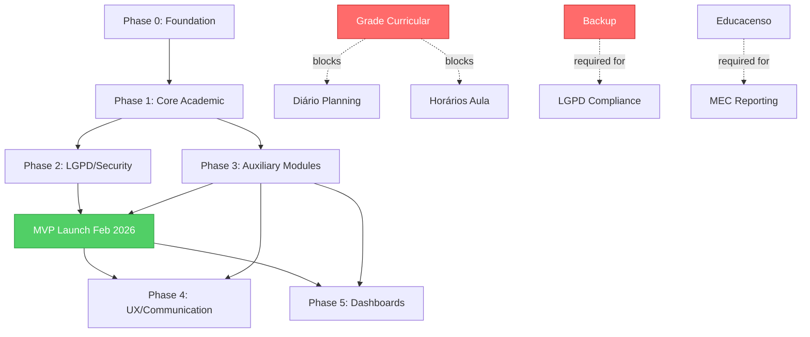

# EDUCA Roadmap v2

**Updated:** 2024-12-14
**Goal:** MVP for 2026 School Year (Feb deadline)
**Baseline:** Stakeholder roadmap + current state analysis (Dec 2024)

---

## Executive Summary

| Phase | Status | Completion | Priority | Remaining Effort |
|-------|--------|------------|----------|------------------|
| 0 Foundation & Infrastructure | ✅ Done | ~95% | - | 1-2 days (polish) |
| 1 Core Academic | ⚠️ Partial | ~70% | P0 | 8-11 days |
| 2 LGPD/Compliance & Security | ⚠️ Partial | ~50% | P1 | 5-7 days |
| 3 Auxiliary Modules | ⚠️ Partial | ~40% | P2 | 2-3 days (MVP scope) |
| 4 UX/Communication | ⚠️ Partial | ~40% | P3 | Post-MVP |
| 5 Dashboards by Profile | ⚠️ Partial | ~35% | P3 | Post-MVP |

**Total MVP Effort:** ~15-21 days
**Critical Blocker:** Grade Curricular (Phase 1) - blocks lesson planning workflow

---

## What's Done (Completed Since Original 004)

### Recent Additions (Dec 2024)

✅ **Calendário Escolar (Dec 14, 2024)**
- Table `calendario_escolar` with RLS by school
- Functions `is_dia_letivo()` and `contar_dias_letivos()` for attendance integration
- Page `/dashboard/calendario` with monthly view
- Components `CalendarioEventForm` and `CalendarioEventList`
- 6 event types: feriado, recesso, dia_letivo, evento, reuniao, conselho
- Link added to desktop and mobile sidebars

✅ **LGPD Compliance for Minors Data (Art. 14) (Dec 14, 2024)**
- Public page `/politica-privacidade` with complete policy (9 sections)
- Component `ConsentCheckbox` in `components/lgpd/`
- Mandatory checkbox on guardian registration
- Fields `lgpd_consentimento` and `lgpd_data_consentimento` auto-saved
- Blocks registration without policy acceptance
- Special section highlighting minor data treatment (LGPD Art. 14)

✅ **Service Worker Cache Fix (Dec 14, 2024)**
- Updated `CACHE_NAME` from `v1` to `v2` in `public/sw.js`
- Forces cache refresh for all users, preventing stale JavaScript
- Resolves Supabase queries with incorrect column names

✅ **API Fixes - Dashboard & Diário (Dec 13-14, 2024)**
- Fixed column names in `lib/api/class-diary.ts`
  - `ano` → `ano_letivo` (turmas table)
  - `users!inner(id, name)` → `professor:users(id, nome)`
  - Added null check for `freq.aula_id`
- Fixed dashboard queries:
  - `ativo=true` → `situacao='ativa'` (matriculas)
  - `aluno_id` → `matricula_id` (frequencia)
- Pages `/dashboard/diario` and `/dashboard` now load without errors

✅ **Accessibility Improvements (Dec 13, 2024)**
- Fixed 21 SelectTrigger components missing `id` for Label association
- Pages affected: turmas/nova, alunos/novo, usuarios/novo, matriculas, responsaveis, sessoes, relatorios

✅ **Database Cleanup (Dec 13, 2024)**
- Removed 24 orphaned local migration files (drafts never applied to Supabase)
- Removed edge function `auto-lock-sessions` (not deployed)
- Removed `.temp` Supabase CLI directory

✅ **Preload Cleanup (Dec 13, 2024)**
- Removed unused `<link rel="preload">` for brasao.png and logo-completo.png
- Removed `/public/identity/` directory (~190KB)
- Eliminated "preloaded but not used" warnings on all pages

### Earlier Completion (Nov-Dec 2024)

✅ **Diário de Classe - Phases 4-6**
- Bolsa Família alerts with attendance monitoring (threshold 80%)
- Report page `/relatorios/bolsa-familia` with filters (school, class, period)
- Export to PDF (jsPDF) and Excel (ExcelJS)
- Content report with BNCC skills aggregation
- Page `/relatorios/conteudo` with cards, table, and BNCC summary
- Loading skeletons for class list, attendance grid, panels
- React Query hooks with optimized cache
- Database indexes for attendance and session queries
- Centralized toast feedback system (Sonner)
- Subtle animations on attendance cells and cards
- Accessibility improvements (WCAG 2.1 AA) with aria-labels and keyboard navigation
- Mobile navigation with bottom nav (MobileNav component)

✅ **Security Updates (Nov 2024)**
- Fixed CVE-2025-66478 (Next.js RCE) - upgraded 15.5.3 → 15.5.7
- Removed xlsx library (CVE-2023-30533, CVE-2024-22363), replaced with exceljs 4.4.0
- Fixed path-to-regexp ReDoS vulnerability via Vercel upgrade
- Fixed esbuild CORS and undici vulnerabilities
- Updated ESLint 8.49.0 → 9.39.1
- Reduced production vulnerabilities from 19 to 4

---

## Phase 0: Foundation & Infrastructure ✅

**Status:** 95% Complete
**Remaining Effort:** 1-2 days (polish)
**Priority:** Maintenance only

### Completed ✅

| Feature | Completion | Notes | PR/Commit |
|---------|------------|-------|-----------|
| Arquitetura do Sistema | 100% | Next.js 15 + Supabase, RLS enabled on all tables | Initial |
| Autenticação e Autorização | 100% | Supabase Auth, 7 user types (admin, diretor, secretario, professor, etc.) | Initial |
| RBAC (Role-Based Access Control) | 100% | Row-Level Security policies by school/user type | Multiple migrations |
| Log de Alterações (Audit Trail) | 100% | Tables `audit_logs` and `audit_trail` with IP/user agent tracking | Initial |
| Importação de Dados | 100% | Bulk import via spreadsheets (students, schools, guardians, classes) | Initial |
| Database Schema | 95% | 17 tables with proper foreign keys, constraints, indexes | Ongoing |

### Missing ❌

| Feature | Priority | Effort | Notes |
|---------|----------|--------|-------|
| Migration Consolidation | P3 | 1 day | 42 migrations could be consolidated to ~15 (see prompt 005) |
| Database Documentation | P3 | 4h | Generate ER diagram and table documentation |

### Success Criteria

- [x] All core tables with RLS enabled
- [x] Audit trail captures all CRUD operations
- [x] 7 user types properly configured
- [x] Import functionality working for all entities
- [ ] Migrations consolidated (deferred to post-MVP)

---

## Phase 1: Core Academic ⚠️

**Status:** 70% Complete
**Remaining Effort:** 8-11 days
**Priority:** P0 - CRITICAL PATH
**Blocks:** Lesson planning, teacher workflow, full diary functionality

### Completed ✅

| Feature | Completion | Notes |
|---------|------------|-------|
| Cadastro de Alunos | 100% | Full CRUD with CPF, NIS (Bolsa Família), guardians, documents |
| Cadastro de Responsáveis | 100% | Multiple guardians per student with `aluno_responsaveis` junction table |
| Cadastro de Escolas | 100% | 9 schools, director assignment, contact info |
| Cadastro de Turmas | 100% | Classes with year, grade, shift, capacity, teacher assignment |
| Matrículas | 100% | Enrollment with status tracking (ativa, transferida, concluida, cancelada) |
| Chamada Digital | 90% | Attendance recording by session, immutability rules enforced |
| Diário de Classe - Fundamental | 85% | Content, grades, evaluations by subject area (BNCC) |
| Calendário Escolar | 100% | Events, holidays, recesses, integration with attendance calculation |

### In Progress ⚠️

| Feature | Completion | Gap | Effort to Complete |
|---------|------------|-----|-------------------|
| Diário Ed. Infantil | 40% | Schema exists (`sessoes_aula`), UI components missing for BNCC Campos de Experiência | 3-4 days |
| Frequência - Auto-lock | 80% | Auto-lock at 18:00 BRT implemented but needs testing/polish | 1 day |

### Missing ❌

| Feature | Priority | Effort | Blocks | Tables Needed |
|---------|----------|--------|--------|---------------|
| Grade Curricular | **P0** | **5-7 days** | **Lesson planning, timetable** | `grade_curricular`, `horarios_aula`, `disciplinas_turma` |

### Tasks - Grade Curricular (P0 BLOCKER)

| Task | Priority | Effort | Owner | Dependencies |
|------|----------|--------|-------|--------------|
| Create `grade_curricular` table migration | P0 | 2h | - | - |
| Create `horarios_aula` table migration | P0 | 2h | - | - |
| Create `disciplinas_turma` junction table | P0 | 1h | - | `disciplinas` table exists |
| API endpoint `/api/grade-curricular` | P0 | 4h | - | Tables created |
| API endpoint `/api/horarios-aula` | P0 | 4h | - | Tables created |
| Component `GradeCurricularForm` | P0 | 6h | - | API ready |
| Component `HorariosAulaGrid` (timetable view) | P0 | 8h | - | API ready |
| Page `/dashboard/grade-curricular` | P0 | 4h | - | Components ready |
| Integration with `sessoes_aula` (link sessions to timetable) | P0 | 4h | - | Grade setup |
| Validation: total hours per week per class | P0 | 2h | - | - |
| RLS policies for grade curricular tables | P0 | 2h | - | - |
| **TOTAL** | **P0** | **~37h (5 days)** | - | - |

### Tasks - Diário Ed. Infantil UI (P0 for Infantil schools)

| Task | Priority | Effort | Owner | Dependencies |
|------|----------|--------|-------|--------------|
| Component `CamposExperienciaForm` | P0 | 4h | - | BNCC reference data |
| Component `DireitosAprendizagemChecklist` | P0 | 3h | - | BNCC reference data |
| Component `ObservacoesInfantilTextarea` | P0 | 2h | - | - |
| Page `/dashboard/diario/infantil` | P0 | 6h | - | Components ready |
| Integration with `sessoes_aula` for infantil classes | P0 | 4h | - | - |
| BNCC seed data (Campos de Experiência) | P0 | 4h | - | - |
| **TOTAL** | **P0** | **~23h (3 days)** | - | - |

### Success Criteria - Phase 1

- [x] Students can be registered with all required INEP/Educacenso fields
- [x] Guardians can consent to LGPD policy
- [x] Schools and classes fully configured
- [x] Attendance can be recorded and auto-locks at 18:00
- [x] School calendar integrated with attendance calculation
- [ ] **Teachers can assign subjects to classes with weekly hours**
- [ ] **Weekly timetable visible per class**
- [ ] **Workload tracked per subject (BNCC compliance)**
- [ ] Diário Ed. Infantil fully functional with Campos de Experiência
- [ ] All diary pages accessible from teacher dashboard

### Beads Issues - Grade Curricular

```bash
bd create --title="Create grade_curricular table migration" --type=task --priority=critical
bd create --title="Create horarios_aula timetable table migration" --type=task --priority=critical
bd create --title="Create disciplinas_turma junction table" --type=task --priority=high
bd create --title="Build API endpoints for grade curricular management" --type=task --priority=critical
bd create --title="Build GradeCurricularForm component" --type=feature --priority=critical
bd create --title="Build HorariosAulaGrid timetable view component" --type=feature --priority=critical
bd create --title="Create /dashboard/grade-curricular page" --type=feature --priority=critical
bd create --title="Integrate grade curricular with sessoes_aula" --type=task --priority=high
```

### Beads Issues - Diário Ed. Infantil

```bash
bd create --title="Build CamposExperienciaForm component for BNCC" --type=feature --priority=high
bd create --title="Build DireitosAprendizagemChecklist component" --type=feature --priority=high
bd create --title="Create /dashboard/diario/infantil page" --type=feature --priority=high
bd create --title="Seed BNCC Campos de Experiência data" --type=task --priority=high
```

---

## Phase 2: Compliance, LGPD & Security ⚠️

**Status:** 50% Complete
**Remaining Effort:** 5-7 days
**Priority:** P1 - CRITICAL FOR LAUNCH
**Compliance Risk:** High (LGPD requires backup)

### Completed ✅

| Feature | Completion | Notes | Date |
|---------|------------|-------|------|
| Política de Privacidade (LGPD) | 100% | Public page `/politica-privacidade`, 9 sections, Art. 14 compliance | Dec 14, 2024 |
| Termo de Consentimento | 100% | Checkbox in guardian registration, fields `lgpd_consentimento`, `lgpd_data_consentimento` | Dec 14, 2024 |
| Audit Trail | 100% | Tables `audit_logs` and `audit_trail` track all operations with IP/user agent | Initial |

### Missing ❌ (CRITICAL)

| Feature | Priority | Effort | Compliance | Decision Needed |
|---------|----------|--------|------------|-----------------|
| **Backup Automático** | **P1** | **2-3 days** | **LGPD obrigatório** | Supabase managed vs pg_dump? |
| Criptografia de Dados Sensíveis | P2 | 3-4 days | LGPD recommended | CPF, NIS, health data |

### Tasks - Backup Automático (P1 CRITICAL)

| Task | Priority | Effort | Owner | Decision Point |
|------|----------|--------|-------|----------------|
| Research Supabase Point-in-Time Recovery (PITR) | P1 | 2h | - | Evaluate if sufficient |
| Research pg_dump scheduled backups | P1 | 2h | - | Compare with PITR |
| **DECISION:** Choose backup strategy | P1 | - | User | - |
| **Option A:** Configure Supabase PITR (if available) | P1 | 4h | - | Supabase plan dependent |
| **Option B:** Create Edge Function for pg_dump + S3 upload | P1 | 12h | - | Requires S3 bucket |
| Test restore procedure | P1 | 4h | - | - |
| Document backup retention policy (30 days) | P1 | 2h | - | - |
| Add backup status to admin dashboard | P2 | 4h | - | - |
| **TOTAL (Option A)** | **P1** | **~12h (1.5 days)** | - | - |
| **TOTAL (Option B)** | **P1** | **~24h (3 days)** | - | - |

### Tasks - Criptografia (P2 - Post-MVP)

| Task | Priority | Effort | Owner |
|------|----------|--------|-------|
| Install `@supabase/supabase-js` crypto utilities | P2 | 1h | - |
| Encrypt CPF field in `alunos` and `responsaveis` | P2 | 4h | - |
| Encrypt NIS field in `alunos` | P2 | 2h | - |
| Encrypt health data fields (if exists) | P2 | 4h | - |
| Create migration to encrypt existing data | P2 | 6h | - |
| Update RLS policies for encrypted fields | P2 | 4h | - |
| Test decryption performance | P2 | 4h | - |
| **TOTAL** | **P2** | **~25h (3 days)** | - |

### Success Criteria - Phase 2

- [x] Privacy policy publicly accessible
- [x] Guardian consent required for student registration
- [x] All operations audited with timestamp/user/IP
- [ ] **Daily automated backups running**
- [ ] **Backup restore tested and documented**
- [ ] **30-day retention policy enforced**
- [ ] Sensitive data encrypted at rest (post-MVP)

### Beads Issues - Backup

```bash
bd create --title="Research Supabase PITR vs pg_dump backup solutions" --type=research --priority=critical
bd create --title="Implement automated daily backup solution" --type=feature --priority=critical
bd create --title="Test and document backup restore procedure" --type=task --priority=critical
bd create --title="Create backup monitoring dashboard widget" --type=feature --priority=high
```

---

## Phase 3: Auxiliary Modules ⚠️

**Status:** 40% Complete
**Remaining Effort:** 2-3 days (MVP scope only)
**Priority:** P2 - IMPORTANT
**Note:** Transport and Nutrition deferred to post-MVP

### Completed ✅

| Feature | Completion | Notes | Date |
|---------|------------|-------|------|
| Relatórios Bolsa Família | 100% | Page `/relatorios/bolsa-familia`, filters, PDF/Excel export, 80% threshold alerts | Nov 2024 |

### In Progress ⚠️

| Feature | Completion | Gap | Effort to Complete |
|---------|------------|-----|-------------------|
| Exportação Educacenso | 50% | Table `educacenso_exports` exists, export logic incomplete | 2-3 days |

### Planned (Post-MVP) ❌

| Feature | Priority | Effort | Notes |
|---------|----------|--------|-------|
| Transporte Escolar | P3 | 5-7 days | Routes, vehicles, drivers, student assignment |
| Módulo Nutrição / Merenda | P3 | 5-8 days | Menus, meal tracking, dietary restrictions, reports |

### Tasks - Educacenso Export (P2 for Feb launch)

| Task | Priority | Effort | Owner | Dependencies |
|------|----------|--------|-------|--------------|
| Research Educacenso 2026 file format/layout | P2 | 3h | - | MEC documentation |
| Map EDUCA fields to Educacenso required fields | P2 | 4h | - | Research complete |
| Create export generation function | P2 | 8h | - | Field mapping |
| Create validation rules (INEP codes, CPF, NIS) | P2 | 4h | - | - |
| Page `/dashboard/educacenso` with export controls | P2 | 4h | - | - |
| Test export with sample data | P2 | 4h | - | - |
| **TOTAL** | **P2** | **~27h (3 days)** | - | - |

### Success Criteria - Phase 3 (MVP Scope)

- [x] Bolsa Família reports generated with correct threshold (80%)
- [x] PDF and Excel export working
- [x] Alerts for students below threshold
- [ ] Educacenso export generates valid file format
- [ ] All required INEP fields validated before export
- [ ] Export tested with Secretaria/MEC validator

### Beads Issues - Educacenso

```bash
bd create --title="Research Educacenso 2026 file format requirements" --type=research --priority=high
bd create --title="Map EDUCA database fields to Educacenso layout" --type=task --priority=high
bd create --title="Build Educacenso export generation logic" --type=feature --priority=high
bd create --title="Create /dashboard/educacenso export page" --type=feature --priority=medium
bd create --title="Validate Educacenso export with MEC tools" --type=task --priority=high
```

---

## Phase 4: UX & Communication ⚠️

**Status:** 40% Complete
**Remaining Effort:** Post-MVP (8-12 days)
**Priority:** P3 - ENHANCEMENT
**Note:** Mobile responsive mostly done, rest deferred

### Completed ✅

| Feature | Completion | Notes | Date |
|---------|------------|-------|------|
| Responsivo Mobile | 80% | MobileNav component, responsive layouts, 44px touch targets | Nov 2024 |

### Planned (Post-MVP) ❌

| Feature | Priority | Effort | Notes |
|---------|----------|--------|-------|
| Integração WhatsApp | P3 | 4-5 days | Notifications (attendance, meetings, alerts) via Evolution API |
| Onboarding & Tour Guiado | P3 | 2-3 days | Interactive tutorial on first access, toggle help center |
| Central de Ajuda | P3 | 2-4 days | In-app docs, contextual tooltips, FAQ, tutorial videos |

### Success Criteria - Phase 4 (Post-MVP)

- [x] Mobile-responsive layouts on all pages
- [x] Bottom navigation for mobile
- [ ] WhatsApp notifications configured (attendance, events)
- [ ] First-login onboarding tour
- [ ] Help center accessible from all pages
- [ ] Tutorial videos embedded

---

## Phase 5: Dashboards by Profile ⚠️

**Status:** 35% Complete
**Remaining Effort:** Post-MVP (12-18 days)
**Priority:** P3 - ENHANCEMENT
**Note:** Basic dashboards exist, role-specific views needed

### In Progress ⚠️

| Feature | Completion | Gap | Effort to Complete |
|---------|------------|-----|-------------------|
| Dashboard Professor | 40% | Basic view exists, needs "minhas turmas", pending attendance alerts | 3-4 days |
| Dashboard Admin (Secretaria) | 30% | Statistics shown, needs multi-school view, exports | 4-5 days |

### Planned (Post-MVP) ❌

| Feature | Priority | Effort | Notes |
|---------|----------|--------|-------|
| Dashboard Diretor | P3 | 3-4 days | School-wide view, all classes, indicators, pending items |
| Dashboard Coordenador Pedagógico | P3 | 3-4 days | Pedagogical tracking, diary completion, observations |
| Dashboard Gestor (Secretaria - Enhanced) | P3 | 2-3 days | 9-school comparison, consolidated reports |
| Dashboard Nutricionista | P3 | 4-5 days | Menus, dietary restrictions, meals served, inventory |
| Layout A4 para Impressão | P3 | 1-2 days | Print-optimized CSS for all reports |

### Success Criteria - Phase 5 (Post-MVP)

- [x] Basic teacher dashboard shows assigned classes
- [x] Admin dashboard shows system statistics
- [ ] Teacher sees pending attendance alerts
- [ ] Director sees school-wide indicators
- [ ] Coordinator tracks diary completion
- [ ] Manager compares 9 schools
- [ ] Nutritionist manages menus
- [ ] All reports print correctly on A4

---

## Risk Assessment

| Risk | Probability | Impact | Mitigation | Fallback |
|------|-------------|--------|------------|----------|
| Grade Curricular delays MVP | High | High | **Start immediately after roadmap approval** | Launch without timetable (manual scheduling) |
| LGPD text approval delayed | Medium | Medium | Use template policy, update when approved | Already completed (Dec 14) |
| Backup solution unclear | Medium | High | Research Supabase PITR vs pg_dump this week | Use Supabase automatic backups temporarily |
| Feb 2026 timeline too tight | Medium | High | Focus only P0/P1, defer P2/P3 post-launch | Soft launch Feb, full rollout Mar 2026 |
| Educacenso format changes for 2026 | Low | Medium | Check MEC documentation in Jan 2025 | Use 2025 format as baseline |
| Diário Infantil adoption resistance | Low | Medium | Training sessions with infantil teachers | Provide manual diary option initially |
| Teacher training insufficient | Medium | Medium | Plan 2-week training period before launch | Video tutorials + support hotline |

---

## Timeline to MVP

```
December 2024
├─ Week 1-2: Grade Curricular implementation (5-7 days)
├─ Week 3-4: Diário Ed. Infantil UI (3-4 days)
└─ Week 4: Buffer for polish/testing (2-3 days)

January 2026
├─ Week 1-2: Backup Automático implementation (2-3 days)
├─ Week 2-3: Educacenso export completion (2-3 days)
├─ Week 3-4: Integration testing (3-5 days)
└─ Week 4: Training material preparation (2-3 days)

February 2026
├─ Week 1-2: Pilot rollout (1-2 schools)
├─ Week 2-3: Feedback iteration (2-3 days)
├─ Week 3: Teacher training sessions (all schools)
└─ Week 4: Full production launch (9 schools)

March 2026+
└─ Post-MVP enhancements (Phases 4-5)
```

---

## Dependencies



---

## Next Steps

### Immediate (This Week)
1. ✅ Review and approve roadmap-v2.md
2. ✅ Create SUMMARY.md executive brief
3. **Create prompt 011-grade-curricular-do** for implementation
4. Begin Grade Curricular development (P0 blocker)

### December 2024
1. Complete Grade Curricular (5-7 days)
2. Complete Diário Ed. Infantil UI (3-4 days)
3. Polish Phase 1 features
4. Test end-to-end teacher workflow

### January 2026
1. Implement Backup Automático (2-3 days)
2. Complete Educacenso export (2-3 days)
3. Integration testing across all modules
4. Prepare training materials

### February 2026
1. Pilot launch (2 schools)
2. Collect feedback and iterate
3. Train all teachers (9 schools)
4. Full production launch

### March 2026+ (Post-MVP)
1. WhatsApp integration (4-5 days)
2. Onboarding tour (2-3 days)
3. Enhanced dashboards by role (12-18 days)
4. Transport and Nutrition modules (10-15 days)

---

<metadata>
<confidence>high</confidence>
<dependencies>
- Current state analysis completed (CHANGELOG, git log, DB schema)
- Stakeholder roadmap (HTML) reviewed
- Previous plans (004, 006, 007) incorporated
- Database schema analyzed (17 tables)
- Recent commits analyzed (20 commits, 2 weeks)
</dependencies>
<open_questions>
- Backup solution: Supabase PITR vs pg_dump? (Need to research Supabase plan features)
- Educacenso 2026 format: Any changes from 2025? (Check MEC docs in Jan)
- Grade Curricular effort: Is 5-7 days realistic? (May need 7-10 if complex)
- Training approach: In-person vs video vs both? (User preference needed)
</open_questions>
<assumptions>
- Feb 2026 is hard deadline for MVP
- Core academic (Phase 1) must be 100% complete for MVP
- Phases 4-5 can follow post-launch (Mar-Apr 2026)
- 9 schools will be ready for simultaneous launch
- Teachers have basic computer literacy (minimal training needed)
- Supabase plan supports required backup features
</assumptions>
<validation>
- All features mapped to database tables (17 tables analyzed)
- All completed items cross-referenced with CHANGELOG.md
- All recent changes verified via git log (20 commits)
- All dashboard pages verified via Glob (14 pages found)
- Effort estimates based on similar completed work (diary phases 4-6)
</validation>
</metadata>
