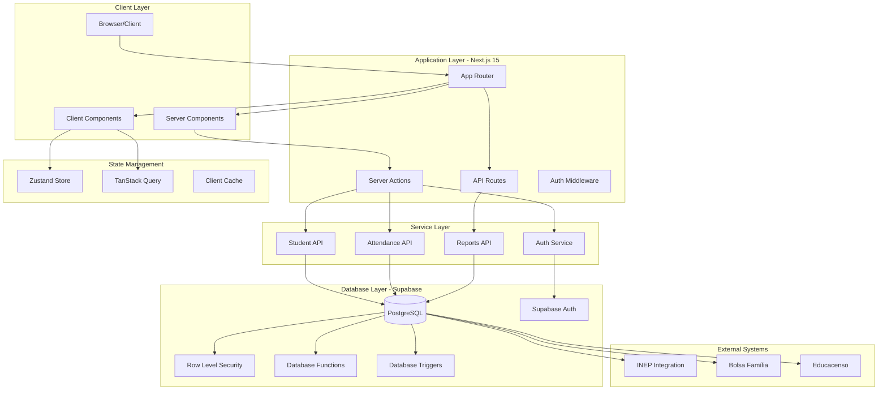
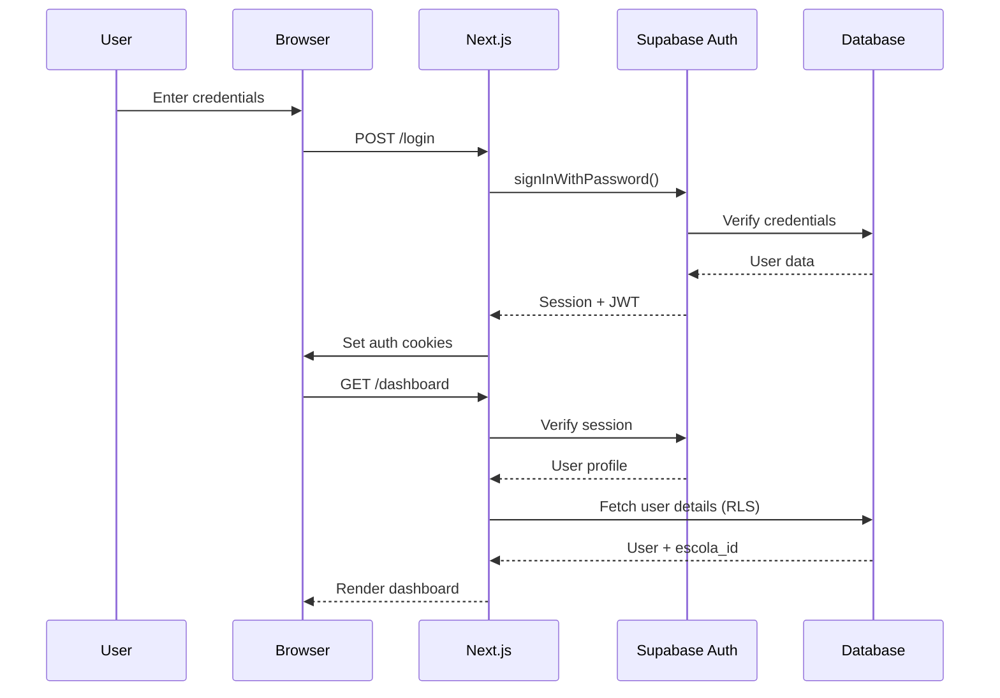
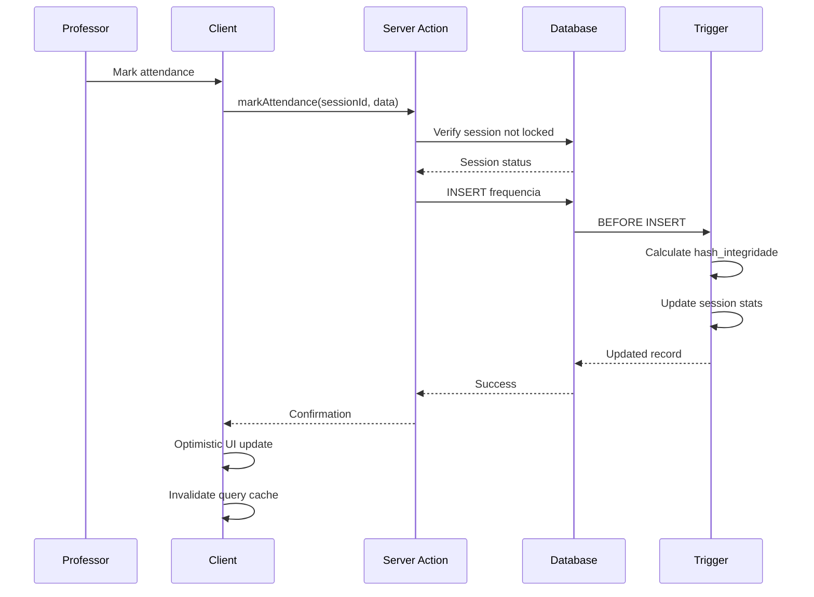
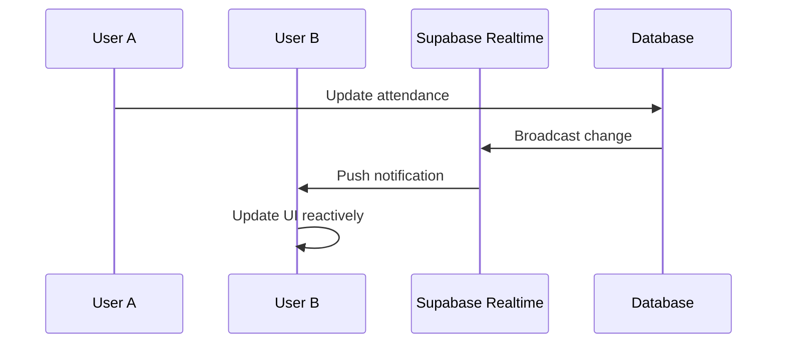
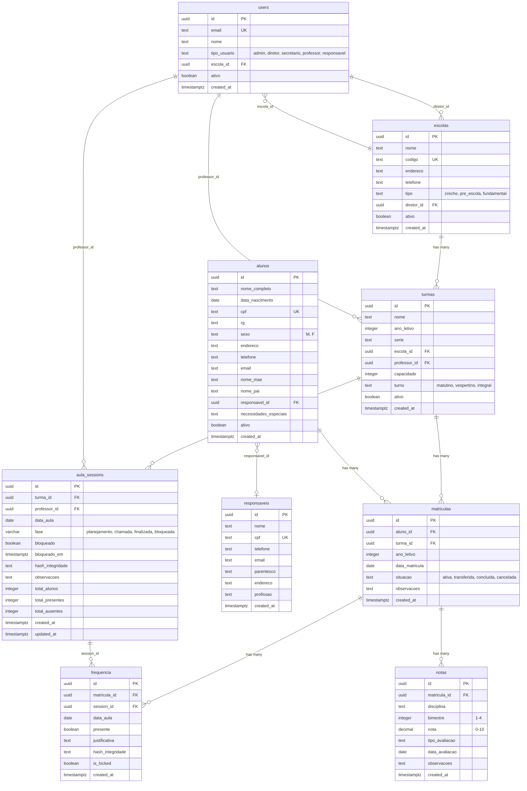

# Sistema de Gestão Escolar - Fronteira/MG
## Project Architecture Documentation

**Version**: 1.0.0 (MVP - 80% Production Ready)
**Last Updated**: 2025-10-10
**Target**: Municipality of Fronteira, Minas Gerais, Brazil

---

## Table of Contents

1. [Project Overview](#project-overview)
2. [Technology Stack](#technology-stack)
3. [High-Level Architecture](#high-level-architecture)
4. [Directory Structure](#directory-structure)
5. [Architectural Layers](#architectural-layers)
6. [Core Modules](#core-modules)
7. [Data Flow](#data-flow)
8. [Authentication & Authorization](#authentication--authorization)
9. [Database Schema](#database-schema)
10. [Key Architectural Decisions](#key-architectural-decisions)
11. [Integration Points](#integration-points)
12. [Performance Optimization](#performance-optimization)
13. [Brazilian Educational Compliance](#brazilian-educational-compliance)
14. [Known Issues & Roadmap](#known-issues--roadmap)

---

## Project Overview

### Purpose
Municipal educational management system for student registration, attendance tracking, and compliance with Brazilian educational standards (INEP, Educacenso, Bolsa Família).

### Current Status
- **MVP Completion**: 80%
- **Production Candidate**: Primary project for municipal deployment
- **Brazilian Compliance**: Full INEP integration framework
- **Multi-School Support**: Complete row-level security implementation

### Key Features
- 5-role RBAC system (admin, diretor, secretario, professor, responsavel)
- INEP-compliant student registration
- Enhanced "Abrir aula" workflow with three-phase attendance
- Automated session locking (18:00 Brazilian time)
- Attendance immutability enforcement
- Real-time data synchronization
- Brazilian timezone and date handling
- CPF and Brazilian phone validation

---

## Technology Stack

### Frontend Framework
```typescript
Next.js: 15.5.3 (App Router with React Server Components)
React: 18.2.0 (Server & Client Components)
TypeScript: 5.2.2 (Strict mode)
```

### UI & Styling
```typescript
shadcn/ui + Radix UI (Component library)
Tailwind CSS: 3.3.3 (Utility-first styling)
Lucide React: 0.446.0 (Icon system)
Next Themes: 0.3.0 (Dark/light mode)
```

### State Management
```typescript
Zustand: 4.4.7 (Global state with persistence)
TanStack Query: 5.17.9 (Server state & caching)
TanStack Table: 8.11.6 (Data tables)
```

### Forms & Validation
```typescript
React Hook Form: 7.53.0 (Form management)
Zod: 3.23.8 (Schema validation)
@hookform/resolvers: 3.9.0 (Form-schema integration)
```

### Backend & Database
```typescript
Supabase: 2.57.4 (PostgreSQL + Auth + Storage + Real-time)
@supabase/ssr: 0.7.0 (Server-side rendering support)
```

### Data Visualization & Export
```typescript
Recharts: 2.12.7 (Charts and analytics)
jsPDF: 3.0.3 + jspdf-autotable: 5.0.2 (PDF generation)
XLSX: 0.18.5 (Excel export for INEP)
```

### Testing
```typescript
Jest: 30.2.0 + React Testing Library: 16.3.0 (Unit tests)
Playwright: 1.55.1 (End-to-end tests)
```

### Package Manager
```
pnpm (Fast, disk-efficient)
```

---

## High-Level Architecture



---

## Directory Structure

### Core Application Structure
```
gestao_fronteira/
├── app/                          # Next.js 15 App Router
│   ├── (auth)/                   # Authentication routes (route group)
│   │   ├── login/               # Login page
│   │   └── role-selection/      # Multi-role selection
│   ├── (dashboard)/             # Protected dashboard routes
│   │   └── dashboard/           # Main application
│   │       ├── alunos/         # Student management
│   │       ├── turmas/         # Class management
│   │       ├── frequencia/     # Attendance tracking
│   │       ├── matriculas/     # Enrollment management
│   │       ├── notas/          # Grade management
│   │       ├── escolas/        # School management
│   │       ├── usuarios/       # User management
│   │       ├── diario/         # Class diary
│   │       ├── relatorios/     # Reports
│   │       └── configuracoes/  # Settings
│   ├── onboarding/              # First-time setup wizard
│   ├── wizard/                  # Multi-step onboarding
│   ├── actions/                 # Server Actions
│   │   └── attendance/         # Attendance-specific actions
│   ├── api/                     # API Routes
│   │   ├── attendance/         # Attendance API
│   │   ├── frequencia/         # Legacy attendance API
│   │   ├── compliance/         # INEP compliance
│   │   └── health/             # Health checks
│   ├── layout.tsx               # Root layout
│   ├── page.tsx                 # Landing page
│   └── providers.tsx            # React context providers
│
├── components/                   # React Components
│   ├── ui/                      # shadcn/ui base components
│   ├── attendance/              # Attendance workflow components
│   ├── students/                # Student management components
│   ├── classes/                 # Class management components
│   ├── auth/                    # Authentication components
│   ├── admin/                   # Admin-specific components
│   ├── dashboard/               # Dashboard widgets
│   ├── charts/                  # Data visualization
│   ├── forms/                   # Form components
│   ├── layout/                  # Layout components
│   ├── compliance/              # Brazilian compliance components
│   ├── reports/                 # Reporting components
│   ├── schools/                 # School management
│   └── providers/               # Context providers
│
├── lib/                         # Utilities & Business Logic
│   ├── supabase/               # Supabase client configuration
│   │   └── server.ts           # Server-side client
│   ├── api/                    # API client functions
│   │   ├── students.ts         # Student operations
│   │   ├── attendance.ts       # Attendance operations
│   │   ├── classes.ts          # Class operations
│   │   └── reports.ts          # Report generation
│   ├── validation/             # Brazilian data validation
│   │   ├── cpf.ts             # CPF validation
│   │   └── phone.ts           # Brazilian phone validation
│   ├── stores/                 # Zustand state stores
│   │   ├── app-store.ts       # Global app state
│   │   └── attendance-session-store.ts  # Attendance state
│   ├── hooks/                  # Custom React hooks
│   ├── auth/                   # Authentication utilities
│   ├── services/               # Business logic services
│   └── utils.ts                # Utility functions
│
├── hooks/                       # Additional custom hooks
│   ├── use-attendance-locking.ts
│   ├── use-attendance-workflow.ts
│   └── use-realtime-attendance.ts
│
├── types/                       # TypeScript type definitions
│   └── database.ts             # Supabase database types
│
├── supabase/                    # Database & Backend
│   ├── migrations/             # SQL migration files
│   │   ├── 20250628095207_wild_block.sql  # Core schema
│   │   ├── 20250920120000_enhanced_abrir_aula_workflow.sql
│   │   ├── 20250115000000_create_audit_logs.sql
│   │   ├── 20250115000001_enable_rls_security.sql
│   │   └── [other migrations...]
│   └── functions/              # Edge Functions
│       └── auto-lock-sessions/ # Automated session locking
│
├── __tests__/                   # Test suites
│   ├── e2e/                    # End-to-end tests (Playwright)
│   ├── integration/            # Integration tests
│   ├── components/             # Component tests
│   ├── compliance/             # Brazilian compliance tests
│   └── performance/            # Performance tests
│
├── scripts/                     # Development scripts
│   ├── seed-dev.ts             # Development data seeding
│   ├── seed-clear.ts           # Clear development data
│   └── seed-superadmin.ts      # Create superadmin user
│
├── docs/                        # Documentation
│   └── PROJECT_INDEX.md        # This file
│
├── public/                      # Static assets
│   └── identity/               # Branding assets
│
├── next.config.js               # Next.js configuration
├── tsconfig.json                # TypeScript configuration
├── tailwind.config.js           # Tailwind CSS configuration
├── package.json                 # Dependencies & scripts
├── .mcp.json                    # MCP servers configuration
└── BUGS-ANALYSIS.md             # Known bugs tracker
```

---

## Architectural Layers

### 1. Presentation Layer (Client & Server Components)

**Location**: `app/`, `components/`

#### Server Components (Default)
- Initial page rendering with data fetching
- SEO-optimized content delivery
- Reduced JavaScript bundle size
- Direct database access via Server Actions

#### Client Components ('use client')
- Interactive UI elements
- State management (Zustand, TanStack Query)
- Real-time updates
- Form handling

**Pattern**:
```typescript
// Server Component (default)
export default async function StudentsPage() {
  const students = await getStudents(); // Direct database call
  return <StudentList initialData={students} />;
}

// Client Component
'use client';
export function StudentList({ initialData }) {
  const { data } = useQuery({
    queryKey: ['students'],
    queryFn: fetchStudents,
    initialData
  });
  // ... interactive UI
}
```

### 2. API Layer (Server Actions + API Routes)

**Location**: `app/actions/`, `app/api/`

#### Server Actions (Preferred)
```typescript
// app/actions/attendance/mark-attendance.ts
'use server';

export async function markAttendance(sessionId: string, attendanceData: AttendanceData) {
  const supabase = await createClient();

  // Verify authorization
  const user = await getCurrentUser();
  await verifyUserRole(['professor', 'admin']);

  // Business logic
  const { data, error } = await supabase
    .from('frequencia')
    .insert(attendanceData);

  return { data, error };
}
```

#### API Routes (Legacy/External)
- Health checks (`/api/health`)
- External integrations
- Webhook handlers
- File downloads

### 3. Service Layer (Business Logic)

**Location**: `lib/api/`, `lib/services/`

**Responsibilities**:
- Complex business logic
- Data transformation
- Multi-table operations
- Brazilian compliance rules

**Example**:
```typescript
// lib/api/students.ts
export async function registerStudent(studentData: StudentInput) {
  // 1. Validate CPF
  if (!validateCPF(studentData.cpf)) {
    throw new Error('Invalid CPF');
  }

  // 2. Create student record
  const student = await createStudent(studentData);

  // 3. Create enrollment
  if (studentData.turma_id) {
    await createEnrollment(student.id, studentData.turma_id);
  }

  // 4. Audit log
  await createAuditLog('student_created', student.id);

  return student;
}
```

### 4. Data Access Layer (Supabase Client)

**Location**: `lib/supabase/`

**Clients**:

#### Standard Client (RLS-enforced)
```typescript
// lib/supabase/server.ts
export async function createClient() {
  const cookieStore = await cookies();
  return createSupabaseServerClient(
    process.env.NEXT_PUBLIC_SUPABASE_URL,
    process.env.NEXT_PUBLIC_SUPABASE_ANON_KEY,
    { cookies: /* ... */ }
  );
}
```

#### Admin Client (Bypasses RLS)
```typescript
export async function createAdminClient() {
  // Uses SUPABASE_SERVICE_ROLE_KEY
  // Use ONLY for admin operations
  // WARNING: Bypasses ALL RLS policies
}
```

### 5. State Management Layer

**Location**: `lib/stores/`, React Context

#### Global State (Zustand)
```typescript
// lib/stores/app-store.ts
interface AppState {
  currentUser: UserProfile | null;
  selectedSchool: string | null;
  sidebarCollapsed: boolean;
  notifications: AppNotification[];
  filters: {
    users: UserFilters;
    students: StudentFilters;
    attendance: AttendanceFilters;
  };
}

export const useAppStore = create<AppState>()(
  devtools(persist(/* ... */))
);
```

#### Server State (TanStack Query)
```typescript
// Caching, refetching, optimistic updates
const { data, isLoading } = useQuery({
  queryKey: ['students', filters],
  queryFn: () => fetchStudents(filters),
  staleTime: 5 * 60 * 1000, // 5 minutes
});
```

### 6. Database Layer (PostgreSQL + Supabase)

**Location**: `supabase/migrations/`

#### Core Tables
- **users**: Authentication & user profiles (5 roles)
- **escolas**: Schools with municipal multi-tenancy
- **alunos**: Students with INEP compliance
- **responsaveis**: Multi-guardian family structure
- **turmas**: Classes with teacher assignments
- **matriculas**: Student enrollments with transfer tracking
- **frequencia**: Daily attendance with immutability
- **notas**: Quarterly grades with Brazilian standards
- **aula_sessions**: Enhanced attendance session management

#### Security Features
- Row Level Security (RLS) on all tables
- School-based data isolation
- Role-based access policies
- Audit trail with timestamps
- Data integrity triggers

---

## Core Modules

### 1. User Management Module

**Completion**: 100%

**Location**: `app/(dashboard)/dashboard/usuarios/`

**Features**:
- 5-role RBAC system
- Role-based UI rendering
- School assignment
- User activation/deactivation
- Profile management

**Roles**:
- **admin**: System administrator (all permissions)
- **diretor**: School director (school-wide access)
- **secretario**: Secretary (administrative access)
- **professor**: Teacher (class-specific access)
- **responsavel**: Guardian (student-specific access)

**Database Policies**:
```sql
-- Users can view own profile
CREATE POLICY "Usuários podem ver próprio perfil"
  ON users FOR SELECT TO authenticated
  USING (auth.uid() = id);

-- Admins can view all users
CREATE POLICY "Admins podem ver todos os usuários"
  ON users FOR SELECT TO authenticated
  USING (EXISTS (
    SELECT 1 FROM users
    WHERE id = auth.uid() AND tipo_usuario = 'admin'
  ));
```

### 2. Student Registration Module

**Completion**: 100%

**Location**: `app/(dashboard)/dashboard/alunos/`

**Features**:
- INEP-compliant student registration
- CPF validation and formatting
- Brazilian phone validation
- Multi-guardian support
- Special needs tracking
- Transfer management
- Document upload (photos, documents)

**Validation**:
```typescript
// CPF validation with digit verification
export function validateCPF(cpf: string): boolean {
  const cleaned = cpf.replace(/\D/g, '');
  if (cleaned.length !== 11) return false;

  // Digit verification algorithm
  // ...
}

// Brazilian phone (mobile/landline)
export function validateBrazilianPhone(phone: string): boolean {
  const cleaned = phone.replace(/\D/g, '');
  return /^[1-9]{2}9?[0-9]{8}$/.test(cleaned);
}
```

### 3. Onboarding Wizard Module

**Completion**: 100%

**Location**: `app/wizard/onboarding/`, `app/onboarding/`

**Features**:
- 6-step school setup process
- School profile creation
- Admin user creation
- Initial class setup
- Academic calendar configuration
- System preferences
- Progress tracking

**Workflow**:
1. Welcome & school information
2. Admin user creation
3. Academic year setup
4. Class structure definition
5. System configuration
6. Completion & activation

### 4. Digital Diary/Attendance Module

**Completion**: 85% (Enhanced "Abrir aula" workflow in progress)

**Location**: `app/(dashboard)/dashboard/frequencia/`, `app/(dashboard)/dashboard/diario/`

**Features**:
- Three-phase attendance workflow:
  1. **Planejamento** (Planning): Lesson planning and preparation
  2. **Chamada** (Roll Call): Attendance marking
  3. **Finalizada** (Finalized): Session completion
- Automated session locking (18:00 Brazilian time)
- Attendance immutability enforcement
- MD5 hash integrity validation
- Real-time attendance sync
- Bulk attendance operations
- Historical attendance tracking

**Database Schema**:
```sql
CREATE TABLE aula_sessions (
  id uuid PRIMARY KEY,
  turma_id uuid NOT NULL REFERENCES turmas(id),
  professor_id uuid NOT NULL REFERENCES users(id),
  data_aula date NOT NULL,
  fase varchar(20) DEFAULT 'planejamento'
    CHECK (fase IN ('planejamento', 'chamada', 'finalizada', 'bloqueada')),
  bloqueado boolean DEFAULT false,
  bloqueado_em timestamp with time zone,
  hash_integridade text,
  total_alunos integer DEFAULT 0,
  total_presentes integer DEFAULT 0,
  total_ausentes integer DEFAULT 0,
  CONSTRAINT unique_session_per_day UNIQUE (turma_id, data_aula)
);
```

**Automated Locking**:
```sql
-- Runs hourly via pg_cron
CREATE OR REPLACE FUNCTION auto_lock_daily_sessions()
AS $$
BEGIN
  UPDATE aula_sessions
  SET bloqueado = true, fase = 'bloqueada'
  WHERE bloqueado = false
    AND (data_aula < CURRENT_DATE
         OR (data_aula = CURRENT_DATE AND CURRENT_TIME >= '18:00:00'));
END;
$$;
```

### 5. Reports & Analytics Module

**Completion**: 85% (Enhanced reporting planned)

**Location**: `app/(dashboard)/dashboard/relatorios/`

**Features**:
- INEP compliance reports (Educacenso-ready exports)
- Bolsa Família integration (attendance compliance)
- Frequency reports (class and individual)
- Active Search reports (at-risk students below 80%)
- Academic performance analytics
- PDF and Excel export
- Real-time data visualization

**Export Formats**:
- PDF (jsPDF + jspdf-autotable)
- Excel (XLSX)
- CSV
- JSON (API integration)

---

## Data Flow

### 1. Authentication Flow



### 2. Attendance Marking Flow



### 3. Real-time Data Sync Flow



---

## Authentication & Authorization

### Authentication Strategy

**Provider**: Supabase Auth

**Flow**: Cookie-based session management with JWT

**Implementation**:
```typescript
// Server-side authentication
export async function getCurrentUser() {
  const supabase = await createClient();
  const { data: { user }, error } = await supabase.auth.getUser();

  if (error || !user) return null;
  return user;
}

// Role verification
export async function verifyUserRole(
  allowedRoles: ('admin' | 'diretor' | 'secretario' | 'professor' | 'responsavel')[]
) {
  const user = await getCurrentUser();
  if (!user) return false;

  const supabase = await createClient();
  const { data: userData } = await supabase
    .from('users')
    .select('tipo_usuario')
    .eq('id', user.id)
    .single();

  return allowedRoles.includes(userData.tipo_usuario);
}
```

### Authorization (Row Level Security)

**Strategy**: Multi-layered RLS policies for school-based data isolation

**Example Policies**:

```sql
-- Students: Only users from same school can view
CREATE POLICY "Usuários autenticados podem ver alunos"
  ON alunos FOR SELECT TO authenticated
  USING (
    EXISTS (
      SELECT 1 FROM users
      WHERE id = auth.uid()
      AND tipo_usuario IN ('admin', 'secretario', 'diretor', 'professor')
    )
  );

-- Attendance: Session-based access
CREATE POLICY "frequencia_session_based"
  ON frequencia FOR ALL TO authenticated
  USING (
    session_id IN (
      SELECT id FROM aula_sessions
      WHERE professor_id = auth.uid()
         OR turma_id IN (
           SELECT t.id FROM turmas t
           WHERE t.professor_id = auth.uid()
         )
    )
  );
```

### Authorization Matrix

| Role | Users | Escolas | Alunos | Turmas | Frequencia | Notas | Relatórios |
|------|-------|---------|--------|--------|------------|-------|------------|
| **admin** | Full | Full | Full | Full | Full | Full | Full |
| **diretor** | School | School | School | School | School | School | School |
| **secretario** | School | School | School | School | Read | Read | School |
| **professor** | Read | Read | Read | Own Classes | Own Classes | Own Classes | Own Classes |
| **responsavel** | Own | Read | Own Children | Read | Own Children | Own Children | Own Children |

---

## Database Schema

### Entity Relationship Diagram



### Indexes & Performance

**High-Performance Indexes**:
```sql
-- User lookups by school and role
CREATE INDEX idx_users_escola ON users(escola_id);
CREATE INDEX idx_users_tipo ON users(tipo_usuario);

-- Student relationships
CREATE INDEX idx_alunos_responsavel ON alunos(responsavel_id);

-- Class relationships
CREATE INDEX idx_turmas_escola ON turmas(escola_id);
CREATE INDEX idx_turmas_professor ON turmas(professor_id);

-- Enrollment lookups
CREATE INDEX idx_matriculas_aluno ON matriculas(aluno_id);
CREATE INDEX idx_matriculas_turma ON matriculas(turma_id);

-- Attendance performance
CREATE INDEX idx_frequencia_matricula ON frequencia(matricula_id);
CREATE INDEX idx_frequencia_session_id ON frequencia(session_id);

-- Session management
CREATE INDEX idx_aula_sessions_turma_data ON aula_sessions(turma_id, data_aula);
CREATE INDEX idx_aula_sessions_professor ON aula_sessions(professor_id);
CREATE INDEX idx_aula_sessions_fase ON aula_sessions(fase);

-- Composite indexes for common queries
CREATE INDEX idx_aula_sessions_turma_data_fase
  ON aula_sessions(turma_id, data_aula, fase);
```

---

## Key Architectural Decisions

### 1. Next.js 15 App Router (not Pages Router)

**Rationale**:
- Server Components for improved performance
- Simplified data fetching patterns
- Better TypeScript support
- Layout composition
- Streaming and Suspense

**Trade-offs**:
- Newer API (less mature ecosystem)
- Client/Server boundary requires careful management
- Migration complexity from Pages Router

### 2. Server Actions over API Routes

**Rationale**:
- Type-safe end-to-end
- Simplified data mutations
- Automatic serialization
- Better DX for server-client communication

**Pattern**:
```typescript
// Server Action
'use server';
export async function updateStudent(id: string, data: StudentData) {
  // Direct database access, full type safety
}

// Client usage
import { updateStudent } from '@/app/actions/students';

await updateStudent(studentId, formData);
```

### 3. Supabase for Backend (not custom Node.js)

**Rationale**:
- Built-in authentication
- Row Level Security for multi-tenancy
- Real-time subscriptions
- PostgreSQL with full SQL capabilities
- Edge Functions for serverless
- Managed infrastructure

**Trade-offs**:
- Vendor lock-in
- Limited customization of auth flow
- Database access via MCP tools (not local CLI)

### 4. Zustand + TanStack Query (not Redux)

**Rationale**:
- **Zustand**: Simple, performant global state
- **TanStack Query**: Server state caching and synchronization
- Separation of concerns (client state vs server state)
- Better DX than Redux boilerplate

**Pattern**:
```typescript
// Global UI state (Zustand)
const { sidebarCollapsed, setSidebarCollapsed } = useAppStore();

// Server state (TanStack Query)
const { data: students } = useQuery({
  queryKey: ['students'],
  queryFn: fetchStudents
});
```

### 5. pnpm over npm/yarn

**Rationale**:
- Faster installation (symlinked node_modules)
- Disk space efficiency (content-addressable storage)
- Strict dependency resolution
- Workspace support

### 6. Three-Phase Attendance Workflow

**Rationale**:
- **Legal Compliance**: Attendance is "único documento oficial" (sole official document)
- **Immutability**: "não existe o esquecer" (no forgetting/modifying)
- **Audit Trail**: Complete history with timestamps and hashes
- **Automated Locking**: 18:00 Brazilian time enforcement
- **Integrity Validation**: MD5 hashing for tampering detection

---

## Integration Points

### 1. Supabase Integration

**Client Creation**:
```typescript
// Server-side (RLS-enforced)
const supabase = await createClient();

// Admin operations (bypasses RLS)
const adminSupabase = await createAdminClient();
```

**Real-time Subscriptions**:
```typescript
const channel = supabase
  .channel('attendance-changes')
  .on('postgres_changes',
    { event: 'INSERT', schema: 'public', table: 'frequencia' },
    (payload) => {
      // Handle real-time attendance updates
    }
  )
  .subscribe();
```

### 2. shadcn/ui Component Integration

**Installation Pattern**:
```bash
pnpm dlx shadcn-ui@latest add button
```

**Usage**:
```typescript
import { Button } from '@/components/ui/button';

<Button variant="default" size="lg">
  Salvar
</Button>
```

### 3. Brazilian Validation Integration

**CPF Validation**:
```typescript
import { validateCPF, formatCPF } from '@/lib/validation/cpf';

const isValid = validateCPF('123.456.789-00');
const formatted = formatCPF('12345678900'); // '123.456.789-00'
```

**Phone Validation**:
```typescript
import { validateBrazilianPhone } from '@/lib/validation/phone';

validateBrazilianPhone('(11) 98765-4321'); // true
validateBrazilianPhone('(11) 3456-7890');  // true (landline)
```

### 4. INEP/Educacenso Integration

**Location**: `lib/api/inep-integration.ts`

**Export Format**:
```typescript
export async function generateEducacensoExport(schoolId: string) {
  // Stage 1: Initial Enrollment Data
  const enrollmentData = await fetchEnrollmentData(schoolId);

  // Stage 2: Student Status Update
  const statusData = await fetchStudentStatus(schoolId);

  // Generate CSV in INEP format
  return generateCSV(enrollmentData, statusData);
}
```

### 5. Bolsa Família Integration

**Attendance Monitoring**:
```typescript
export async function checkBolsaFamiliaCompliance(studentId: string) {
  const attendanceRate = await calculateAttendanceRate(studentId);

  // Alert if below 80% threshold
  if (attendanceRate < 0.80) {
    await createAlert({
      type: 'bolsa_familia_risk',
      student_id: studentId,
      message: `Attendance below 80%: ${attendanceRate * 100}%`
    });
  }
}
```

---

## Performance Optimization

### 1. Code Splitting & Bundle Optimization

**Next.js Configuration**:
```javascript
// next.config.js
experimental: {
  optimizePackageImports: [
    'lucide-react',
    'date-fns',
    '@radix-ui/react-*',
    'recharts'
  ]
}
```

### 2. Database Query Optimization

**Indexes**: All foreign keys and common query patterns indexed

**N+1 Prevention**:
```typescript
// Bad: N+1 query
for (const student of students) {
  const guardian = await getGuardian(student.responsavel_id);
}

// Good: Single join query
const studentsWithGuardians = await supabase
  .from('alunos')
  .select(`
    *,
    responsaveis (*)
  `);
```

### 3. Caching Strategy

**TanStack Query**:
```typescript
const { data } = useQuery({
  queryKey: ['students', filters],
  queryFn: () => fetchStudents(filters),
  staleTime: 5 * 60 * 1000,     // 5 minutes
  gcTime: 10 * 60 * 1000,       // 10 minutes (formerly cacheTime)
});
```

**Zustand Persistence**:
```typescript
persist(
  (set, get) => ({ /* state */ }),
  {
    name: 'app-store',
    partialize: (state) => ({
      sidebarCollapsed: state.sidebarCollapsed,
      filters: state.filters,
      settings: state.settings
    })
  }
)
```

### 4. Image Optimization

**Next.js Image Component**:
```tsx
import Image from 'next/image';

<Image
  src="/student-photos/123.jpg"
  alt="Student photo"
  width={96}
  height={96}
  priority={false}
/>
```

**Configuration**:
```javascript
// next.config.js
images: {
  formats: ['image/webp', 'image/avif'],
  deviceSizes: [320, 420, 768, 1024, 1200],
  imageSizes: [16, 32, 48, 64, 96, 128, 256]
}
```

### 5. Real-time Optimization

**Debounced Updates**:
```typescript
const debouncedSync = useMemo(
  () => debounce(syncAttendance, 500),
  []
);
```

---

## Brazilian Educational Compliance

### 1. INEP Standards

**Educacenso Data Collection**:
- **Stage 1** (May 28 - Jul 31, 2025): Initial enrollment data
- **Stage 2** (Feb 2 - Mar 13, 2026): Student status updates

**Required Data Points**:
- Student individualized data (CPF, enrollment status, attendance)
- Teacher classroom assignments and qualifications
- Class structure and academic calendar alignment
- Educational establishment information

### 2. Bolsa Família Program

**Education Conditionalities**:
- Minimum 80% school attendance required
- Real-time attendance monitoring
- Automated alerts for at-risk students
- Integration with Unique Registration System (Cadastro Único)

**Implementation**:
```sql
-- Students below 80% threshold
CREATE VIEW at_risk_students AS
SELECT
  a.id,
  a.nome_completo,
  COUNT(CASE WHEN f.presente THEN 1 END)::decimal / COUNT(*)::decimal as attendance_rate
FROM alunos a
JOIN matriculas m ON m.aluno_id = a.id
JOIN frequencia f ON f.matricula_id = m.id
WHERE m.ano_letivo = EXTRACT(YEAR FROM CURRENT_DATE)
GROUP BY a.id, a.nome_completo
HAVING COUNT(CASE WHEN f.presente THEN 1 END)::decimal / COUNT(*)::decimal < 0.80;
```

### 3. Legal Compliance

**Attendance Immutability**:
- "não existe o esquecer" (no retroactive modification)
- Automatic session locking at 18:00
- MD5 hash integrity validation
- Complete audit trail

**Data Protection (LGPD)**:
- Row Level Security enforcement
- Data subject rights management
- Consent tracking
- Audit logging

### 4. Brazilian Timezone & Date Handling

**Configuration**:
```typescript
// Brazilian timezone (America/Sao_Paulo)
const brazilTime = new Date().toLocaleString('pt-BR', {
  timeZone: 'America/Sao_Paulo'
});

// Date format: DD/MM/YYYY (Brazilian standard)
const formattedDate = format(date, 'dd/MM/yyyy', { locale: ptBR });
```

---

## Known Issues & Roadmap

### Known Bugs

**See**: `gestao_fronteira/BUGS-ANALYSIS.md` for detailed tracking

**Critical Issues**:
1. **Login Redirect**: Partially fixed (profile wait logic needed)
2. **Toaster setState**: React 19 compatibility (dynamic import fix)
3. **Delete Operations**: RLS policy conflicts on turmas/matriculas

### Roadmap to 100% Production (36.5 hours)

1. **Enhanced "Abrir aula" Workflow** (8h) - Complete three-phase system
2. **Attendance Locking Mechanism** (4h) - Legal compliance enforcement
3. **Multi-Guardian Management** (8h) - Complex family structures
4. **INEP Integration** (6h) - Government reporting automation
5. **Comprehensive Audit System** (4h) - LGPD compliance
6. **Enhanced RLS Policies** (2h) - Multi-school security hardening
7. **Brazilian Validation Library** (2.5h) - Government standard validation
8. **Advanced Reporting** (2h) - Analytics and exports

### Future Enhancements

- Real-time notifications system
- Mobile app (React Native)
- Advanced analytics dashboard
- AI-powered student risk prediction
- Parent portal
- SMS integration for alerts
- QR code attendance marking
- Offline mode support

---

## Cross-References

### Related Documentation
- **Main README**: `../README.md`
- **CLAUDE.md**: Development guidelines and MCP usage
- **BUGS-ANALYSIS.md**: Known issues and fixes
- **Migration Files**: `supabase/migrations/` (database schema evolution)

### Key Files to Reference

**Authentication**:
- `lib/supabase/server.ts` - Supabase client creation
- `lib/auth.ts` - Authentication utilities
- `app/(auth)/login/page.tsx` - Login implementation

**Database**:
- `supabase/migrations/20250628095207_wild_block.sql` - Core schema
- `supabase/migrations/20250920120000_enhanced_abrir_aula_workflow.sql` - Attendance system
- `types/database.ts` - TypeScript types

**State Management**:
- `lib/stores/app-store.ts` - Global Zustand store
- `lib/stores/attendance-session-store.ts` - Attendance state

**API & Services**:
- `app/actions/attendance/` - Attendance server actions
- `lib/api/` - Service layer implementations

### Getting Started

1. **Setup**: Follow `../CLAUDE.md` for environment configuration
2. **Database**: Use Supabase MCP tools (not local CLI)
3. **Development**: `pnpm dev` for local server
4. **Testing**: `pnpm test` (unit) + `pnpm test:e2e` (Playwright)
5. **Documentation**: Reference this file for architecture decisions

---

**Document Version**: 1.0.0
**Last Updated**: 2025-10-10
**Maintained By**: Development Team
**Status**: Living Document (update as architecture evolves)
