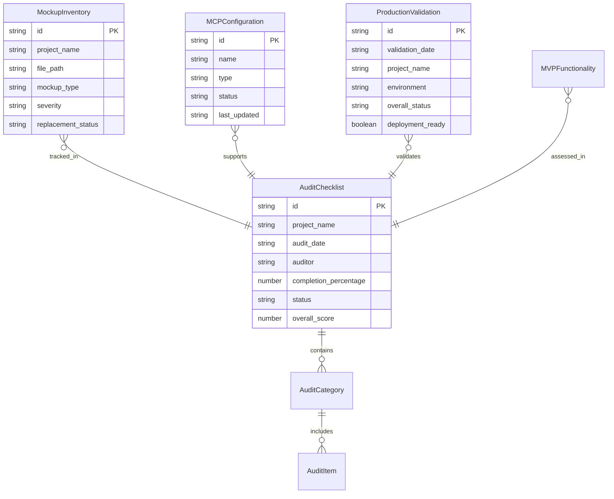

# Production Readiness Audit Data Model

**Date**: 2025-09-14
**Phase**: 1 - Design & Contracts
**Status**: In Progress

## Audit Data Structures

### 1. Audit Checklist Schema

```typescript
interface AuditChecklist {
  id: string;
  project_name: string;
  audit_date: string;
  auditor: string;
  completion_percentage: number;
  status: 'pending' | 'in_progress' | 'completed' | 'failed';
  categories: AuditCategory[];
  overall_score: number;
}

interface AuditCategory {
  name: string;
  weight: number;
  items: AuditItem[];
  score: number;
}

interface AuditItem {
  id: string;
  description: string;
  priority: 'critical' | 'high' | 'medium' | 'low';
  status: 'pass' | 'fail' | 'not_applicable';
  evidence?: string;
  notes?: string;
  remediation_required: boolean;
}
```

### 2. Mockup Inventory Schema

```typescript
interface MockupInventory {
  id: string;
  project_name: string;
  file_path: string;
  component_name?: string;
  mockup_type: 'hardcoded_data' | 'placeholder_text' | 'test_users' | 'demo_content' | 'fake_api_responses';
  severity: 'critical' | 'high' | 'medium' | 'low';
  description: string;
  replacement_status: 'identified' | 'planned' | 'in_progress' | 'completed';
  replacement_plan?: string;
  estimated_effort: number; // hours
  assigned_to?: string;
  deadline?: string;
}

interface MockupPattern {
  pattern: string;
  description: string;
  file_extensions: string[];
  common_locations: string[];
}
```

### 3. MCP Configuration Schema

```typescript
interface MCPConfiguration {
  id: string;
  name: string;
  type: 'supabase' | 'shadcn-ui' | 'playwright' | 'custom';
  status: 'not_configured' | 'configured' | 'active' | 'error';
  config: MCPConfig;
  last_updated: string;
  health_check_url?: string;
}

interface MCPConfig {
  // Supabase MCP
  supabase_url?: string;
  supabase_anon_key?: string;
  project_id?: string;

  // shadcn/ui MCP
  components_path?: string;
  ui_library_version?: string;

  // Playwright MCP
  browser_config?: BrowserConfig;
  test_patterns?: string[];

  // Custom settings
  custom_settings?: Record<string, any>;
}

interface BrowserConfig {
  headless: boolean;
  browser_type: 'chromium' | 'firefox' | 'webkit';
  viewport: { width: number; height: number };
  timeout: number;
}
```

### 4. Production Validation Schema

```typescript
interface ProductionValidation {
  id: string;
  validation_date: string;
  project_name: string;
  environment: 'staging' | 'production';
  validator: string;
  validation_results: ValidationResult[];
  overall_status: 'pass' | 'fail' | 'partial';
  deployment_ready: boolean;
}

interface ValidationResult {
  category: ValidationCategory;
  test_name: string;
  status: 'pass' | 'fail' | 'warning';
  metrics?: ValidationMetrics;
  error_details?: string;
  recommendations?: string[];
}

type ValidationCategory =
  | 'security'
  | 'performance'
  | 'functionality'
  | 'compliance'
  | 'usability'
  | 'reliability';

interface ValidationMetrics {
  page_load_time?: number;
  response_time?: number;
  memory_usage?: number;
  error_rate?: number;
  availability_percentage?: number;
  concurrent_users_supported?: number;
}
```

### 5. MVP Functionality Tracking

```typescript
interface MVPFunctionality {
  id: string;
  project_name: string;
  module_name: string;
  feature_name: string;
  completion_percentage: number;
  status: 'not_started' | 'in_progress' | 'completed' | 'blocked';
  user_roles_supported: string[];
  brazilian_compliance: ComplianceStatus;
  testing_status: TestingStatus;
  dependencies: string[];
  blockers: string[];
}

interface ComplianceStatus {
  cpf_validation: boolean;
  non_retroactive_data: boolean;
  audit_trail: boolean;
  rls_policies: boolean;
  lgpd_compliance: boolean;
}

interface TestingStatus {
  unit_tests: boolean;
  integration_tests: boolean;
  e2e_tests: boolean;
  performance_tests: boolean;
  security_tests: boolean;
}
```

## Entity Relationships



## Validation Rules

### Critical Path Validations
1. **No Critical Mockups**: All critical severity mockups must be resolved
2. **Security Compliance**: All security audit items must pass
3. **Performance Benchmarks**: All performance targets must be met
4. **Brazilian Compliance**: All educational regulations must be satisfied

### Data Integrity Rules
1. **Audit Traceability**: Every audit item must have evidence
2. **Mockup Tracking**: Every identified mockup must have replacement plan
3. **MCP Health**: All configured MCPs must be operational
4. **Validation Coverage**: All MVP functionality must be validated

### Business Rules
1. **Project Priority**: gestao_fronteira has highest audit priority
2. **Critical Path**: Security and compliance items block deployment
3. **Incremental Progress**: Audit can proceed with non-critical items pending
4. **Documentation Required**: All configurations must be documented

## State Transitions

### Audit Item Lifecycle
```
not_started → identified → analyzed → planned → in_progress → completed → verified
                    ↓
                blocked ← → resolved
```

### Mockup Replacement Lifecycle
```
identified → planned → in_progress → completed → verified → production_ready
      ↓
   blocked ← → resolved
```

### MCP Configuration Lifecycle
```
not_configured → configured → active → monitored
        ↓
    error ← → resolved
```

## Storage Implementation

### Recommended Storage
- **Primary**: Local JSON files for audit tracking
- **Backup**: Supabase tables for team collaboration
- **Export**: CSV/Excel for reporting
- **Integration**: Connect with existing gestao_fronteira database

### File Structure
```
specs/002-production-readiness-audit/
├── data/
│   ├── audit-checklists.json
│   ├── mockup-inventory.json
│   ├── mcp-configurations.json
│   ├── validation-results.json
│   └── mvp-functionality.json
├── exports/
│   ├── audit-report-YYYY-MM-DD.csv
│   └── production-readiness-summary.pdf
└── templates/
    ├── audit-checklist-template.json
    └── validation-template.json
```

## Integration Points

### Existing Systems
- **gestao_fronteira database**: Read existing schema and RLS policies
- **Supabase project**: Validate configuration and permissions
- **Git repository**: Track changes and audit trail
- **CI/CD pipeline**: Integrate production validation checks

### MCP Integrations
- **Supabase MCP**: Direct database access for schema validation
- **shadcn/ui MCP**: Component verification and documentation
- **Playwright MCP**: Automated UI testing and validation

This data model provides the foundation for systematic production readiness auditing with full traceability and compliance tracking.