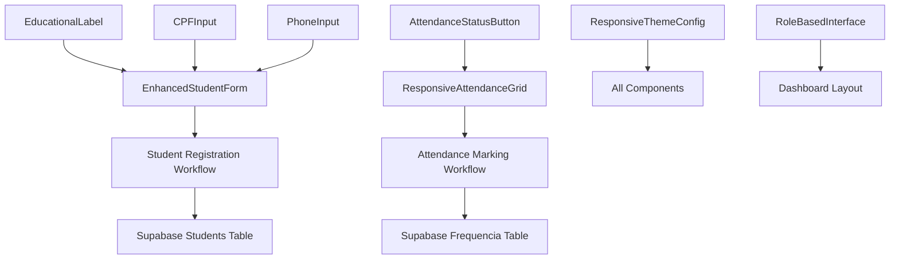

# UI/UX Design System Data Model

**Date**: 2025-09-15
**Feature**: UI/UX Design System Enhancement
**Phase**: Phase 1 - Design & Contracts

## Overview

This document defines the data structures and component hierarchy for the UI/UX design system enhancement of the SRE Educational Management System. The model extends existing gestao_fronteira components with enhanced mobile-first responsive design patterns.

## UI Component Hierarchy

### 1. Base UI Components (shadcn/ui Extensions)

#### EducationalLabel
```typescript
interface EducationalLabelProps extends LabelProps {
  required?: boolean
  educational?: boolean
  tooltip?: string
}
```

**Purpose**: Enhanced form labeling with Brazilian Portuguese educational terminology
**Validation Rules**: Required field indicators, tooltip accessibility
**State Transitions**: None (static component)

#### CPFInput
```typescript
interface CPFInputProps extends Omit<InputProps, 'onChange'> {
  value?: string
  onChange?: (value: string) => void
  showValidation?: boolean
}
```

**Purpose**: Brazilian CPF number input with real-time validation
**Validation Rules**: 11-digit CPF algorithm validation, formatting mask
**State Transitions**:
- `idle` → `validating` → `valid|invalid`
- Auto-formatting on input change

#### PhoneInput
```typescript
interface PhoneInputProps extends Omit<InputProps, 'onChange'> {
  value?: string
  onChange?: (value: string) => void
  region?: 'mobile' | 'landline'
}
```

**Purpose**: Brazilian phone number input with regional formatting
**Validation Rules**: Brazilian phone pattern validation (mobile: 11 digits, landline: 10 digits)
**State Transitions**: Format validation on blur event

#### AttendanceStatusButton
```typescript
interface AttendanceStatusButtonProps extends ButtonProps {
  status: 'present' | 'absent' | 'late' | 'justified'
  studentId: string
  onStatusChange: (studentId: string, status: AttendanceStatus) => void
  touchOptimized?: boolean
}
```

**Purpose**: Touch-optimized attendance marking for mobile devices
**Validation Rules**: Single-tap confirmation, visual feedback required
**State Transitions**:
- `idle` → `pressed` → `confirmed` → `synced`
- Auto-collapse after 500ms confirmation delay

### 2. Composite Educational Components

#### EnhancedStudentForm
```typescript
interface EnhancedStudentFormProps {
  initialData?: Partial<StudentFormData>
  onSubmit: (data: StudentFormData) => Promise<void>
  mode: 'create' | 'edit'
  showProgressIndicator?: boolean
}

interface StudentFormData {
  // Personal Information
  nome_completo: string
  cpf?: string
  data_nascimento: Date
  telefone?: string
  sexo: 'M' | 'F'

  // Educational Information
  nivel_educacional: 'creche' | 'pre_escola' | 'fundamental'
  necessidades_especiais?: string
  observacoes?: string

  // Guardian Information
  responsavel_principal: ResponsavelData
  responsavel_secundario?: ResponsavelData
}
```

**Purpose**: Multi-section student registration with progressive disclosure
**Validation Rules**:
- Age-based CPF requirement (optional if under 16)
- Educational level validation based on birth date
- Minimum one responsible guardian required
**State Transitions**: Form wizard with section validation gates

#### ResponsiveAttendanceGrid
```typescript
interface ResponsiveAttendanceGridProps {
  students: StudentWithAttendance[]
  turmaId: string
  date: Date
  onAttendanceChange: (studentId: string, status: AttendanceStatus) => void
  viewMode: 'grid' | 'list'
  orientation: 'portrait' | 'landscape'
}
```

**Purpose**: Adaptive attendance marking interface for different screen orientations
**Validation Rules**:
- Immutable attendance records after save
- Real-time sync validation
- Minimum 75% attendance tracking (Brazilian requirement)
**State Transitions**:
- Grid layout adaptation on orientation change
- Optimistic updates with rollback on network failure

### 3. Theme Configuration Schema

#### ResponsiveThemeConfig
```typescript
interface ResponsiveThemeConfig {
  breakpoints: {
    mobile: string        // '320px'
    tablet: string        // '768px'
    desktop: string       // '1024px'
  }

  colors: {
    attendance: AttendanceColorScheme
    performance: PerformanceColorScheme
    educational_level: EducationalLevelColorScheme
  }

  spacing: EducationalSpacingScale
  typography: EducationalTypographyScale

  accessibility: {
    highContrast: boolean
    reducedMotion: boolean
    screenReaderOptimized: boolean
  }
}

interface AttendanceColorScheme {
  present: string      // '#22c55e'
  absent: string       // '#ef4444'
  late: string         // '#f59e0b'
  justified: string    // '#3b82f6'
}
```

**Purpose**: Centralized theming for educational UI consistency
**Validation Rules**: WCAG 2.1 AA color contrast ratios (4.5:1 minimum)
**State Transitions**: Theme switching with preference persistence

### 4. User Role Interface Mappings

#### RoleBasedInterface
```typescript
interface RoleBasedInterface {
  role: 'admin' | 'diretor' | 'secretario' | 'professor' | 'responsavel'
  permissions: UserPermission[]
  dashboardLayout: DashboardLayoutConfig
  navigationItems: NavigationItemConfig[]
  defaultViews: ViewConfiguration[]
}

interface ViewConfiguration {
  component: string
  props: Record<string, any>
  responsive: ResponsiveViewConfig
}

interface ResponsiveViewConfig {
  mobile: ComponentLayout
  tablet: ComponentLayout
  desktop: ComponentLayout
}
```

**Purpose**: Role-specific interface customization with responsive adaptations
**Validation Rules**: Permission-based component rendering, RLS policy compliance
**State Transitions**: Dynamic layout updates based on viewport and user role

## Data Relationships



## Component State Management

### 1. Form State (React Hook Form + Zod)
```typescript
interface FormStateManager<T> {
  formData: T
  errors: FormErrors<T>
  isSubmitting: boolean
  isDirty: boolean
  isValid: boolean
  touchedFields: TouchedFields<T>
}
```

### 2. UI State (Local Component State)
```typescript
interface UIStateManager {
  viewport: ViewportState
  theme: ThemeState
  accessibility: AccessibilityState
  orientation: OrientationState
}
```

### 3. Synchronization State (Supabase Real-time)
```typescript
interface SyncStateManager {
  connectionStatus: 'online' | 'offline' | 'syncing'
  queuedOperations: QueuedOperation[]
  lastSyncTimestamp: Date
  conflictResolution: ConflictResolutionStrategy
}
```

## Validation Rules Summary

### Brazilian Educational Compliance
1. **CPF Validation**: 11-digit algorithm with check digits (optional for minors)
2. **Phone Validation**: Brazilian mobile (11 digits) or landline (10 digits)
3. **Age Validation**: Educational level must match age ranges defined by Brazilian law
4. **Attendance Requirements**: Minimum 75% attendance threshold monitoring

### Accessibility Compliance (WCAG 2.1 Level AA)
1. **Color Contrast**: Minimum 4.5:1 ratio for all text/background combinations
2. **Touch Targets**: Minimum 44px (enhanced to 56px for educational context)
3. **Keyboard Navigation**: Full keyboard accessibility for all interactive elements
4. **Screen Reader Support**: Comprehensive ARIA labeling in Portuguese

### Performance Requirements
1. **Mobile Load Time**: <2s on 2 Mbps connections (Brazilian infrastructure)
2. **Touch Response**: <100ms for attendance marking interactions
3. **Animation Performance**: 60fps with reduced motion support
4. **Form Validation**: <300ms response time for real-time validation

## Integration Points

### Existing Database Schema (gestao_fronteira)
- **Students Table**: Direct integration, no schema changes required
- **Frequencia Table**: Enhanced with real-time updates and offline support
- **Users Table**: Extended with UI preference storage
- **Turmas Table**: Integration with attendance grid filtering

### New Database Extensions
```sql
-- UI preferences table
CREATE TABLE IF NOT EXISTS user_ui_preferences (
  id uuid DEFAULT gen_random_uuid() PRIMARY KEY,
  user_id uuid REFERENCES auth.users(id) ON DELETE CASCADE,
  theme_preferences jsonb DEFAULT '{}',
  accessibility_preferences jsonb DEFAULT '{}',
  layout_preferences jsonb DEFAULT '{}',
  created_at timestamp with time zone DEFAULT now(),
  updated_at timestamp with time zone DEFAULT now()
);

-- Offline operation queue
CREATE TABLE IF NOT EXISTS offline_operations (
  id uuid DEFAULT gen_random_uuid() PRIMARY KEY,
  user_id uuid REFERENCES auth.users(id) ON DELETE CASCADE,
  operation_type text NOT NULL,
  operation_data jsonb NOT NULL,
  created_at timestamp with time zone DEFAULT now(),
  sync_status text DEFAULT 'pending'
);
```

## Next Steps

This data model supports the creation of:
1. **TypeScript Interface Contracts** (Phase 1 - contracts/)
2. **Component Implementation Tasks** (Phase 2 - tasks.md)
3. **Visual Regression Test Scenarios** (Phase 1 - quickstart.md)
4. **Real-time Synchronization Logic** (Phase 2 implementation)

All entities defined support the constitutional requirements of test-first development and maintain compatibility with existing gestao_fronteira architecture.